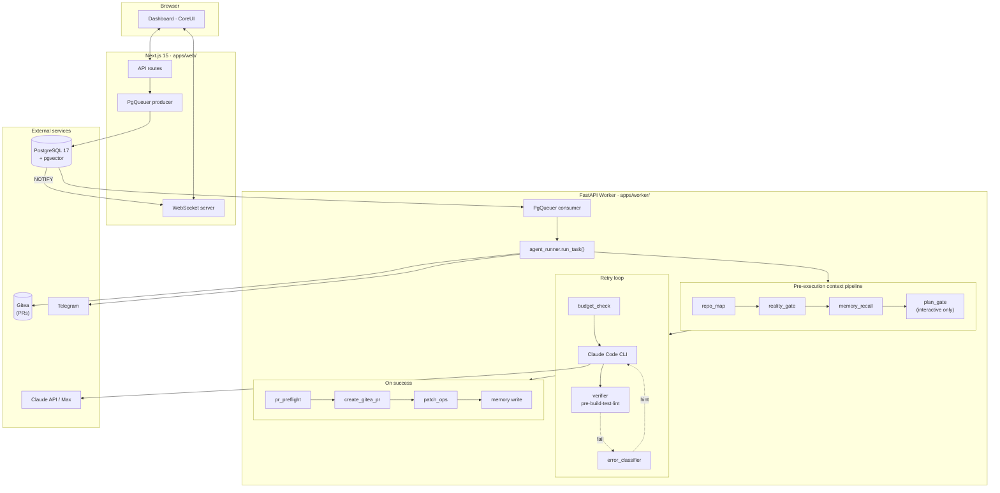

<div align="center">

# DevServer

### An autonomous coding pipeline for Claude Code CLI agents.

**Dispatches coding tasks → runs the agent in an isolated git worktree → verifies build/test/lint → opens a pull request on Gitea.**

[](LICENSE)
[](https://nextjs.org/)
[](https://react.dev/)
[](https://python.org/)
[](https://fastapi.tiangolo.com/)
[](https://postgresql.org/)
[](https://github.com/pgvector/pgvector)
[](docker/)


[Why](#why-devserver) · [Features in Pictures](#features-in-pictures) · [Architecture](#architecture) · [Design Decisions](#design-decisions) · [Quick Start](#quick-start) · [Project Layout](#project-layout) · [Roadmap](#roadmap)

</div>

---

## Why DevServer?

Most autonomous coding agents ship as a closed SaaS, a VS Code extension, or a CLI glued to GitHub. DevServer is the opposite: a **self-hosted orchestration platform** for people who already run their own infrastructure and want agents to work on their terms.

- 🧠 **Evidence-driven agent context.** Before any code is written, the worker builds a **multi-language repo map**, scans the last 14 days of commits for collisions, checks open PRs via the Gitea API, and queries a pgvector-backed memory of past tasks — then compiles a weighted **0–100 reality signal** with an explainable evidence chain, so the agent never starts blind.
- 🎯 **Targeted retries, not blanket re-runs.** Failures are classified by 20+ regex rules (import errors, TS compile errors, test failures, merge conflicts, …) and the next attempt receives a surgical remediation hint. Recurring hard errors *escalate* instead of burning retries.
- ✋ **Human-in-the-loop plan gate.** Tasks opened in interactive mode pause for a structured JSON plan review before any file is touched. The approved plan becomes a contract the agent is bound to.
- 💰 **Per-task budget circuit breaker.** Hard ceilings on USD cost and wall-clock seconds, enforced at every retry iteration. Tasks that cross a limit terminate with status `blocked`, never "I silently burned through your API quota at 3 am".
- 🛡️ **Deterministic PR preflight.** Between "verifier passed" and `git push`, a non-LLM review step checks author identity, enforces the plan's file allow-list, scans for leaked secrets (Anthropic / OpenAI / AWS / GitHub / Slack / Google / Stripe / PEM keys), and rejects files larger than 1 MB.
- 📦 **Downloadable patch export.** Every successful task auto-generates `git format-patch` output as individual `.patch` files plus a single `combined.mbox`. One click in the dashboard → `git am < combined.mbox` on a production mirror repo (GitHub, GitLab, TFS, anywhere). No API integration required.
- 🔎 **Full live observability.** PG `NOTIFY` → WebSocket → dashboard. Every agent step (repo map, reality signal, memory recall, plan approval, error class, budget warning, preflight, patches generated) is a typed event on a live timeline.

All of the above are real code paths, not marketing bullets. See [`apps/worker/src/services/`](apps/worker/src/services/) for the implementations.

## Features in Pictures

Six surfaces, each backed by code in this repo. Click any image to view full-size on GitHub.

### 🏠 Dashboard — what's running, what's queued, what cost what

<a href="assets/dashboard.png"></a>

The landing page. Live counts of running and queued tasks, today's completed/failed/cost totals from `daily_stats`, and a queue control toolbar. Everything updates in real time over the WebSocket — no page refresh.

📂 [`apps/web/src/app/page.tsx`](apps/web/src/app/page.tsx) · [`apps/web/src/components/Dashboard.tsx`](apps/web/src/components/Dashboard.tsx)

---

### 📋 Tasks — the full backlog with status and priority

<a href="assets/tasks.png"></a>

The full task backlog. Filter by status (`pending` / `queued` / `running` / `verifying` / `done` / `failed` / `blocked` / `cancelled`), by repo, by priority (1=critical → 4=low). Each row links to the task detail view.

📂 [`apps/web/src/app/tasks/page.tsx`](apps/web/src/app/tasks/page.tsx) · [`apps/web/src/components/TaskTable.tsx`](apps/web/src/components/TaskTable.tsx)

---

### 🔍 Task Detail — events, runs, patches, agent settings

<a href="assets/viewtask.png"></a>

The single most information-dense view in the product. From left:

- **Description & acceptance criteria** — editable inline; the *Fill Task* button uses the bundled `devtask` Claude skill to generate a structured task spec from a one-line description.
- **Live event log** — every `repo_map_built`, `reality_signal`, `memory_recall`, `plan_pending`, `plan_approved`, `error_classified`, `budget_warning`, `pr_preflight_pass`, `patches_generated`, `rate_limit_backoff` event as it streams in over PG `NOTIFY` → WebSocket.
- **Task log** — real-time tail of the per-task log file at `logs/tasks/{task_key}.log`.
- **Patches panel** — one-click download of `combined.mbox` plus a copy-to-clipboard `git am` command for cross-repo propagation.
- **Run history** — every retry attempt with status, duration, cost, and turn count.
- **Agent settings** — per-task overrides for `max_turns`, `claude_model`, `git_flow` (Branch + PR / Direct commit / Patch only), and `skip_verify`.

📂 [`apps/web/src/app/tasks/[id]/page.tsx`](apps/web/src/app/tasks/[id]/page.tsx) · [`apps/web/src/components/TaskDetail.tsx`](apps/web/src/components/TaskDetail.tsx) · [`apps/web/src/components/PatchesPanel.tsx`](apps/web/src/components/PatchesPanel.tsx)

---

### 💡 Ideas — hierarchical brainstorm tree, convertible to tasks

<a href="assets/ideas.png"></a>

A lightweight brainstorm space. Folders contain other folders or **idea leaves** (markdown content). When an idea is ready, click *Convert to Task* and it lands in the tasks backlog with the description pre-populated. Idea ↔ task linkage is preserved in the database (`ideas.task_id`) so you can always trace a shipped PR back to where the thought started.

📂 [`apps/web/src/app/ideas/page.tsx`](apps/web/src/app/ideas/page.tsx) · [`apps/web/src/components/IdeasView.tsx`](apps/web/src/components/IdeasView.tsx) · [`database/migrations/003_ideas.sql`](database/migrations/003_ideas.sql)

---

### 📄 Logs — live tail of worker and web process output

<a href="assets/logs.png"></a>

A real-time log viewer with two tabs — `worker.log` and `web.log` — polled every 1.5 seconds. Lines are colour-coded by severity (ERROR in red, WARNING in yellow, INFO in blue, DEBUG in green). A pulsing live indicator turns red on fetch errors. Auto-scrolls to the bottom as new lines arrive; a jump-to-bottom button appears when you scroll up. Toolbar buttons reload from the beginning or clear the display without losing the underlying file.

📂 [`apps/web/src/app/logs/page.tsx`](apps/web/src/app/logs/page.tsx) · [`apps/web/src/components/LogsView.tsx`](apps/web/src/components/LogsView.tsx) · [`apps/web/src/app/api/logs/[name]/route.ts`](apps/web/src/app/api/logs/[name]/route.ts)

---

### ⚙️ Settings — global queue and system LLM configuration

<a href="assets/settings.png"></a>

A single-page control panel for the worker's global behaviour. The **Queue Status** card shows live counts from `QueueStats`. The **General** card exposes: execution mode (autonomous / interactive / paused), max concurrency (1–10), queue-paused and auto-enqueue toggles, Telegram notification toggle, and the **System LLM** vendor + model picker used by Fill Task and DevPlan. Saving writes all fields in parallel via `PUT /api/settings` with no page reload required.

📂 [`apps/web/src/app/settings/page.tsx`](apps/web/src/app/settings/page.tsx) · [`apps/web/src/components/SettingsForm.tsx`](apps/web/src/components/SettingsForm.tsx)

## Architecture



Three small services, one shared PostgreSQL. No Redis, no RabbitMQ, no Celery — **PgQueuer** uses the same database everything else lives in.

## Design Decisions

These are the non-obvious choices that turned "a shell around `claude -p`" into something interesting.

### 1. Reality signal before the first edit

The single largest source of wasted agent effort is hallucinated context — an LLM inventing file paths, misremembering symbol names, or re-implementing work that shipped yesterday. Inspired by [`mnemox-ai/idea-reality-mcp`](https://github.com/mnemox-ai/idea-reality-mcp)'s *pre-decision evidence gate*, DevServer runs four parallel sources **before** any Claude subprocess starts:

1. **Repo map hit-rate** — does the text of the task actually mention things that exist in the codebase?
2. **Recent-commit overlap** — have the files this task targets been touched in the last 14 days?
3. **Open-PR collision** — is there an `agent/<key>` branch already open on Gitea?
4. **Historical outcomes** — pgvector similarity search over `agent_memory` for "we've seen tasks like this before".

Each source emits a signal `∈ [0, 1]` and a one-line evidence string. They're combined with weighted averaging into a 0–100 score with **graceful degradation** — if a source fails, its weight is redistributed across the survivors rather than blocking the task. The whole thing renders into the Claude prompt as a short "here is what I already know" block.

📂 [`apps/worker/src/services/reality_gate.py`](apps/worker/src/services/reality_gate.py)

### 2. Spec → Plan → Implement gate for interactive tasks

For tasks marked `mode='interactive'`, execution splits into two phases:

- **Plan phase** — Claude is invoked with read-only tools (`Read,Glob,Grep`, capped at 30 turns) and asked to emit a structured JSON plan: summary, approach, per-step list, **exhaustive `files_to_touch` allow-list**, risks, acceptance check.
- **Human gate** — the plan is stored in `task_runs.plan_json`, a `plan_pending` event fires on the dashboard, and the worker polls `tasks.plan_approved_at` / `plan_rejected_at` for up to 1 hour.
- **Implement phase** — only runs after a human clicks Approve. The approved plan is injected as a **"HUMAN-APPROVED CONTRACT"** block binding Claude to the `files_to_touch` allow-list.

After verification passes, that same allow-list is re-checked by the PR preflight — any file outside the plan becomes a scope-creep violation and the agent is told to revert it.

📂 [`apps/worker/src/services/plan_gate.py`](apps/worker/src/services/plan_gate.py)

### 3. Error-class-aware retries, not blanket re-runs

The naive "append stderr, retry" loop costs a full Claude session per attempt. DevServer instead runs verifier/Claude output through 20 regex rules spanning Python, TypeScript / Node, C# / .NET, Rust, Go, Java, Git, and shell. Each matched rule produces a structured `ErrorClass(key, hint, severity)`:

- **`recoverable`** errors (import error, test failure, TS compile error) inject a surgical remediation hint into the next retry's prompt.
- **`hard`** errors (merge conflict, `git nothing to commit`, `command not found`, permission denied) escalate immediately — no more retries.
- A `recoverable` class that repeats across two attempts escalates too, on the theory that "same error twice" means the agent is stuck.

The fix is kept at the regex layer because it's deterministic, auditable, and makes new rules a 5-minute pull request.

📂 [`apps/worker/src/services/error_classifier.py`](apps/worker/src/services/error_classifier.py)

### 4. Deterministic PR preflight with real secret scanning

After the verifier passes but before `git push`, every PR goes through a non-LLM review:

| Check | Severity | Outcome on violation |
|---|---|---|
| HEAD commit authored by the configured DevServer identity | hard | task → `blocked` |
| Changed files subset of `plan.files_to_touch` (interactive mode) | recoverable | inject scope-creep hint, retry |
| Secret scan — Anthropic / OpenAI / AWS / GitHub / Slack / Google / Stripe / PEM private keys / Telegram / hardcoded passwords + forbidden filenames (`.env`, `id_rsa`, …) | hard | task → `blocked` |
| File size — anything over 1 MB | hard | task → `blocked` |

The secret rules use careful placeholder filtering to avoid the "SuperSecret123 contains the word secret, therefore it's a placeholder" false-negative class. The whole step runs in well under a second and is the same guarantee a dedicated security team would enforce with pre-commit hooks — implemented once, reused by every task.

📂 [`apps/worker/src/services/pr_preflight.py`](apps/worker/src/services/pr_preflight.py)

### 5. Per-task budget circuit breaker

Two nullable columns on the `tasks` table — `max_cost_usd` and `max_wall_seconds` — bound every task's spend. Cumulative counters are maintained across retries and checked at the top of every iteration:

- Crossing 80% of either limit fires a one-shot `budget_warning` event.
- Crossing a hard limit fires `budget_exceeded`, breaks out of the retry loop, and terminates the task in status **`blocked`** (distinguishable from plain `failed`).
- Cost enforcement is skipped in Max-subscription mode since the CLI always reports `cost_usd=0`.

Runaway retry loops were the single largest operational risk of running agents unattended overnight. Now they can't happen — a budget is a physical limit, not a good intention.

📂 [`apps/worker/src/services/agent_runner.py`](apps/worker/src/services/agent_runner.py) (search for `_check_budget`)

### 6. Cross-repo propagation via `git format-patch`

DevServer pushes PRs to a Gitea repo that may be a mirror / experimental of a larger production repo elsewhere (GitHub, GitLab, Azure DevOps). To move changes over without writing a full API client per host, every successful task auto-generates:

- `0001-<subject>.patch`, `0002-<subject>.patch`, … (one per commit)
- `combined.mbox` — a single concatenated file ready for `git am`

The dashboard Patches panel offers one-click download of the mbox plus a copy-to-clipboard command:

```sh
git checkout -b from-devserver/<key> main
git am < combined.mbox
git push origin from-devserver/<key>
```

Commit authorship survives the patch apply. Works against any git host, zero API integration, zero tokens required on the production side.

📂 [`apps/worker/src/services/patch_ops.py`](apps/worker/src/services/patch_ops.py) · [`apps/web/src/components/PatchesPanel.tsx`](apps/web/src/components/PatchesPanel.tsx)

## Tech Stack

| Layer | Choice | Why |
|---|---|---|
| **Frontend** | Next.js 15 App Router · React 19 · CoreUI Pro | Server components for the task detail page, client components for real-time panels, CoreUI for a consistent CSS system without reinventing the wheel. |
| **Backend worker** | Python 3.12 · FastAPI · SQLAlchemy 2.0 async · asyncpg | Async from top to bottom. Every subprocess, every DB call, every Claude invocation is non-blocking. |
| **Job queue** | [PgQueuer](https://github.com/janbjorge/pgqueuer) | PostgreSQL-native queue. No Redis, no RabbitMQ, no operational surface to monitor beyond Postgres itself. |
| **Database** | PostgreSQL 17 + pgvector 0.7 | Relational truth + vector similarity in one store. `agent_memory` lives in the same transaction as `tasks` and `task_runs`. |
| **Real-time** | `LISTEN/NOTIFY` → WebSocket | Zero-dependency pub/sub. Dashboard updates arrive within ~100 ms of a worker emitting an event. |
| **AI engine** | Claude Code CLI (Anthropic API or Max subscription) | DevServer *orchestrates* an existing CLI instead of reimplementing agent logic. Lets the best-in-class tool do the best-in-class job. |
| **Git platform** | Gitea / Forgejo | Self-hosted and API-compatible. The same code works against any Gitea-derived forge. |
| **Notifications** | Telegram Bot API | Because you're not at your desk when the budget breaker fires at 2 am. |
| **Package mgmt** | `uv` (Python) · `npm` (Node) | Fast, cacheable, boring. |

## Quick Start

### Prerequisites

- Node.js ≥ 22 LTS
- Python ≥ 3.12
- PostgreSQL ≥ 16 with the `vector` extension available
- `claude` CLI installed and authenticated (`claude login`)
- `uv` for Python dependency management — [install guide](https://docs.astral.sh/uv/)
- A Gitea (or Forgejo) instance with a personal access token

### Local setup (host processes)

```bash
git clone https://github.com/<YOUR_GITHUB_HANDLE>/DevServer.git
cd DevServer
cp config/.env.example .env
# edit .env — fill in PGPASSWORD, GITEA_TOKEN, TELEGRAM_*, ANTHROPIC_API_KEY

./scripts/migrate.sh          # runs all SQL migrations
./scripts/start.sh --dev      # starts worker + web in dev mode
```

The dashboard is now at **http://localhost:3000**.

### Docker (recommended for production)

```bash
cd docker
cp ../config/.env.example .env
# edit .env — minimum: PGPASSWORD, ANTHROPIC_API_KEY

docker compose up -d --build
```

The default compose file ships a bundled `pgvector/pgvector:pg17` service,
so the stack runs out of the box on Linux, macOS, and Windows.

#### Linux / macOS — host PostgreSQL (recommended)

If your host already runs PostgreSQL on port 5432, skip the bundled DB
with the host-DB override:

```bash
# If you previously ran the bundled-DB stack, tear it down first
# so the old devserver-postgres container releases port 5432:
docker compose down

docker compose -f docker-compose.yml -f docker-compose.host-db.yml up -d --build
```

On Docker Desktop (macOS) `host.docker.internal` is built in; on Linux
it is mapped through the compose override via `host-gateway`.

**Linux host Postgres prerequisites** (one-time):

1. `postgresql.conf` — add the docker bridge gateway to `listen_addresses`
   (check yours with `ip addr show docker0`, default is `172.17.0.1`):
   ```
   listen_addresses = 'localhost,172.17.0.1'
   ```
2. `pg_hba.conf` — allow the docker bridge subnet:
   ```
   host    devserver    devserver    172.16.0.0/12    scram-sha-256
   ```
3. `sudo systemctl reload postgresql` (listen_addresses needs a full
   restart: `sudo systemctl restart postgresql`).

**macOS host Postgres prerequisites** (one-time, Homebrew install):

1. `postgresql.conf` (usually `/opt/homebrew/var/postgresql@17/postgresql.conf`):
   ```
   listen_addresses = '*'
   ```
2. `pg_hba.conf` — allow the Docker Desktop VM subnet:
   ```
   host    devserver    devserver    192.168.65.0/24    scram-sha-256
   host    devserver    devserver    127.0.0.1/32       scram-sha-256
   ```
3. `brew services restart postgresql@17`.

Make sure the `vector` extension is installed on the host Postgres — on
macOS: `brew install pgvector` then `CREATE EXTENSION vector;` in the
`devserver` database. On Linux: `sudo apt install postgresql-17-pgvector`
(or the equivalent package for your distro).

#### Windows (Docker Desktop)

DevServer is developed on Linux and macOS, and on Windows the only
supported way to run it is via Docker Desktop — do not attempt the
host-process setup (`./scripts/start.sh`). Use **PowerShell** (not CMD)
and **run all commands from the repository root or `docker/`**.

1. Install [Docker Desktop for Windows](https://www.docker.com/products/docker-desktop/)
   with the WSL 2 backend (default on modern installs) and make sure it is
   running.
2. Clone the repo into a WSL filesystem path (e.g. `\\wsl$\Ubuntu\home\<you>\DevServer`)
   or a short Windows path with no spaces. Line endings are handled by the
   bundled `.gitattributes`; if you hit `^M` errors, run
   `git config --global core.autocrlf false` before cloning.
3. Create and edit `.env`:
   ```powershell
   cd docker
   Copy-Item ..\config\.env.example .env
   notepad .env     # set PGPASSWORD and ANTHROPIC_API_KEY at minimum
   ```
4. Build and start the stack:
   ```powershell
   docker compose up -d --build
   ```
5. Open **http://localhost:3000** in your browser.

**Windows-specific notes**

- Always use the default compose file — the `host-db` override is for Linux
  only. Windows has no host Postgres to point at.
- Claude **Max subscription (OAuth)** mount: the commented `claude_auth`
  volume in `docker-compose.yml` expects a Unix path. On Windows, set
  `CLAUDE_CONFIG_DIR` in `.env` to your host config dir using a WSL-style
  path that Docker Desktop understands, e.g.
  `CLAUDE_CONFIG_DIR=/mnt/c/Users/<you>/.claude`, then uncomment the line:
  ```yaml
  - ${CLAUDE_CONFIG_DIR:-${HOME}/.claude}:/root/.claude:ro
  ```
  Leave this mount commented out if you use **API mode** — just set
  `ANTHROPIC_API_KEY` in `.env` and nothing else is required.
- File watching / HMR is not used in Docker mode; Next.js runs the
  production build inside the container.
- Helper scripts under `scripts/` (`start.sh`, `migrate.sh`, …) are bash
  scripts and are not needed on Windows. Everything runs through
  `docker compose`.
- To view logs:
  ```powershell
  docker compose logs -f web
  docker compose logs -f worker
  ```
- To stop / reset the stack:
  ```powershell
  docker compose down              # stop, keep data
  docker compose down -v           # stop and wipe Postgres + worktree volumes
  ```

## Project Layout

```
apps/
  web/                                → Next.js 15 frontend, API routes, PgQueuer producer, WebSocket server
    src/components/
      TaskDetail.tsx                  → Task detail — events, logs, agent settings, run history
        PatchesPanel.tsx              → Download combined.mbox + per-commit patches
        NightCyclePanel.tsx           → Overnight batch runner controls
    src/app/api/
      tasks/                          → FREE — task CRUD + enqueue
        task-patches/                 → Patch list + generate + download
        night-cycle/                  → Start/stop/status
        approve/                      → Interactive plan approval
  worker/                             → Python FastAPI worker + PgQueuer consumer
    src/services/
      _free_hooks.py                  → FREE — no-op stubs (always present)
      agent_runner.py                 → FREE — uses pro.* calls that degrade gracefully
      agent_backends.py               → FREE — vendor abstraction (Claude, Gemini, OpenAI, GLM)
      repo_map.py                     → FREE — multi-language symbol map
      error_classifier.py             → FREE — 20 regex rules → targeted retry hints
      llm_client.py                   → FREE — vendor-agnostic system LLM client
      verifier.py                     → FREE — pre/build/test/lint runner
      git_ops.py                      → FREE — git worktree + Gitea PR creation        __init__.py                   → ProHooks: real implementations of all pro methods
        reality_gate.py               → 0–100 evidence scan
        plan_gate.py                  → Spec → Plan → Implement gate
        pr_preflight.py               → Secret scan + allow-list + author + size check
        patch_ops.py                  → git format-patch generation
        memory.py                     → pgvector recall + store
        night_cycle.py                → Autonomous overnight batch runner
    src/routes/
      internal.py                     → FREE — status, pause, cancel, generate-task, generate-plan
      pro_internal.py                 → PRO — night cycle + patch endpoints
database/
  migrations/                         → Versioned SQL migrations (001–007)
config/
  .env.example                        → Sanitised environment template
docker/
  docker-compose.yml                  → Full stack deployment (Postgres + web + worker)
scripts/
  start.sh / stop.sh / restart.sh     → Dev + prod lifecycle helpers
  migrate.sh                          → Run database migrations
  strip-pro.sh                        → Remove all pro features → free version
```

## Roadmap

**Shipped.** See the [Design Decisions](#design-decisions) section above — every item there is implemented and in production use.

**Intentionally deferred.** Evaluated against named competitors (SWE-agent, Aider, OpenHands, Devin, Cursor Background Agents, Copilot Coding Agent, Sweep AI, Continue, Goose, Cline, Factory AI, Replit Agent 3, Windsurf, Codegen) and explicitly parked:

- **Parallel sub-agents per task** — git worktrees are already per-task; sub-worktrees add complexity with unclear ROI at current scale.
- **Learned rules from review reactions** (Cursor Bugbot style) — requires a dashboard review surface DevServer doesn't expose yet.
- **Sandboxed container per task** (OpenHands style) — overlaps with the existing git worktree + `repo_locks` isolation. Only worth revisiting to run untrusted tasks.
- **Codebase-as-typed-graph** (Codegen style) — the tree-sitter-style repo map captures ~80% of the value at a small fraction of the effort.
- **Automated Option E cross-repo apply** — today `patch_ops.py` generates the `combined.mbox`; a future second-worktree apply step can consume the exact same on-disk layout without touching the module.

Contributions and issues are welcome.

## License

[MIT](LICENSE) — free for personal and commercial use. Attribution appreciated but not required.

## Support / Donations

DevServer is built and maintained in my spare time. If it saves you hours of
work or you'd like to see development continue, consider sending a tip — it
directly funds new features, faster fixes, and ongoing maintenance.

**USDT (TRC20 — Tron network):**

```
TLkm4qjsXWTWhnKJ6JW77ieD891qtJE2a5
```

Every contribution, regardless of size, is genuinely appreciated. Thank you!

---

<div align="center">

### Built by Sergei Zhuravlev
[LinkedIn](https://www.linkedin.com/in/sergeizhuravlev/) · [GitHub](https://github.com/sergiovision) · [hi@sergego.com](mailto:hi@sergego.com)
</div>
