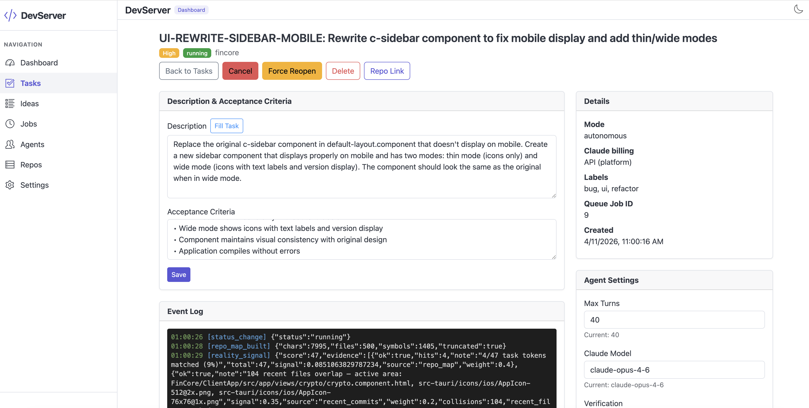
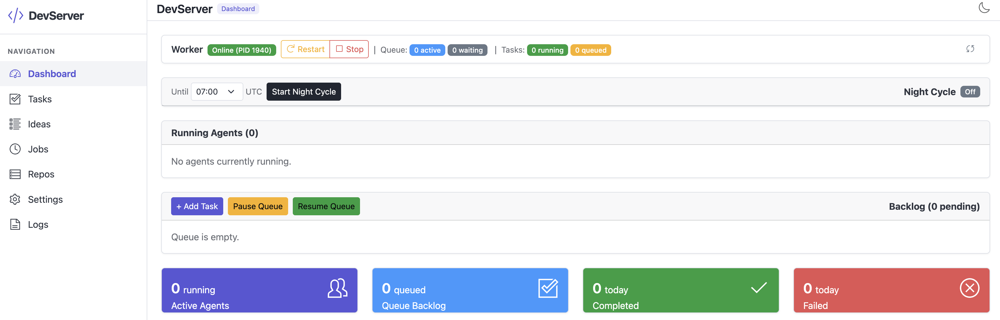
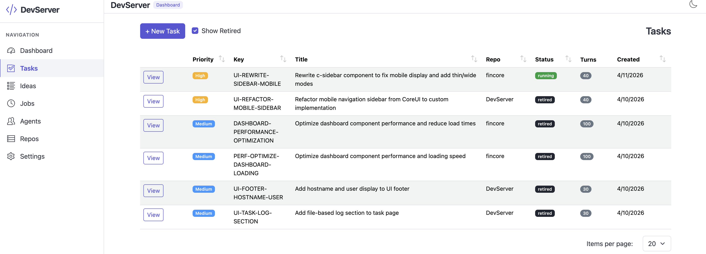
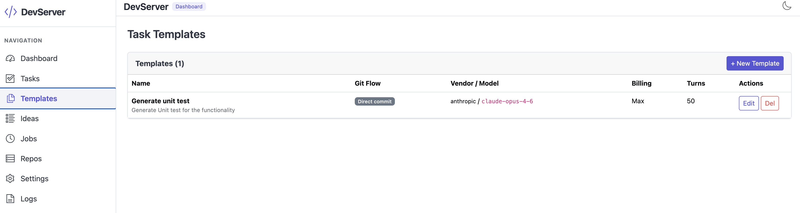
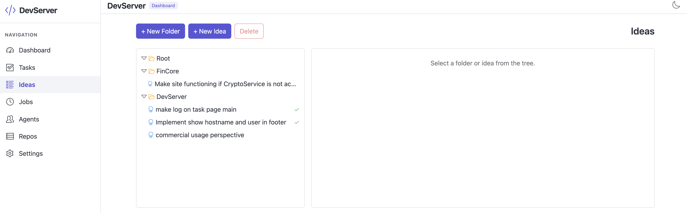
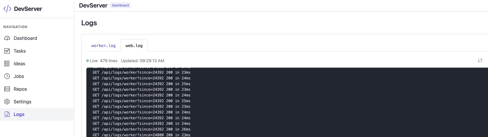
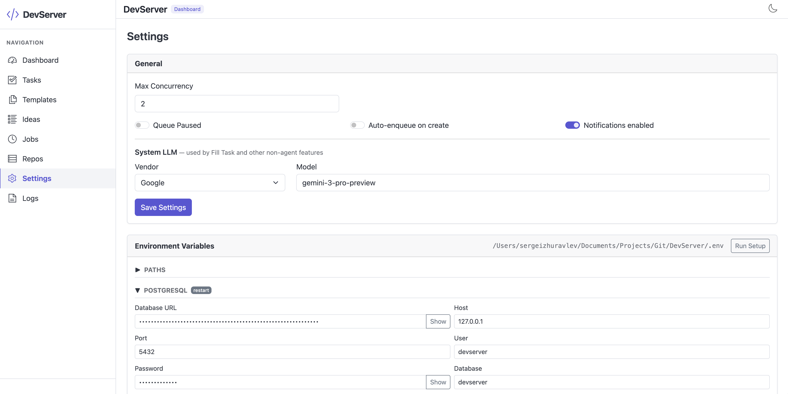
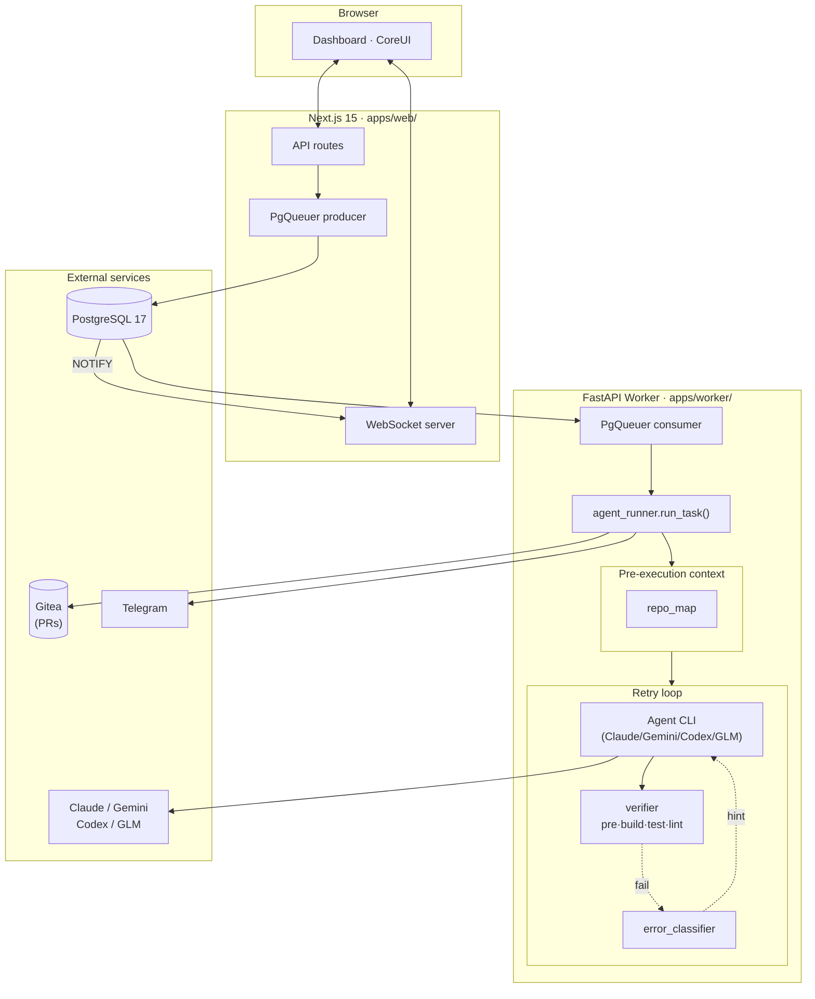

<div align="center">

# DevServer

### An autonomous coding pipeline for AI coding agents.

**Dispatches coding tasks → runs the agent in an isolated git worktree → verifies build/test/lint → opens a pull request on Gitea.**

[](LICENSE)
[](https://nextjs.org/)
[](https://react.dev/)
[](https://python.org/)
[](https://fastapi.tiangolo.com/)
[](https://postgresql.org/)
[](docker/)



[Why](#why-devserver) · [Features](#features) · [Architecture](#architecture) · [Design Decisions](#design-decisions) · [Quick Start](#quick-start) · [Project Layout](#project-layout) · [Pro Edition](#pro-edition) · [Roadmap](#roadmap)

</div>

---

## Why DevServer?

Most autonomous coding agents ship as a closed SaaS, a VS Code extension, or a CLI glued to GitHub. DevServer is the opposite: a **self-hosted orchestration platform** for people who already run their own infrastructure and want agents to work on their terms.

- **Multi-vendor agent backends.** Run tasks on Claude (Anthropic), Gemini (Google), Codex (OpenAI), or GLM (Zhipu AI). Each vendor has a dedicated backend — switch per task via the dashboard. Auto-failover between vendors when rate limits or errors exhaust retries.
- **Error-class-aware retries.** Failures are classified by 20+ regex rules (import errors, TS compile errors, test failures, merge conflicts, ...) and the next attempt receives a surgical remediation hint. Recurring hard errors *escalate* instead of burning retries.
- **Multi-language repo map.** Before any code is written, the worker builds a regex-based symbol index (classes, functions, types) for 11 languages, so the agent starts with an accurate picture of the codebase.
- **Dashboard with analytics.** Live counts, today's stats, per-vendor cost breakdown, average duration and turns-per-task charts, and a period selector for 7–90 days of history.
- **Task templates.** Saved presets for repetitive work ("fix lint errors", "add unit tests", "update deps") with pre-filled descriptions, acceptance criteria, and agent settings.
- **Full live observability.** PG `NOTIFY` → WebSocket → dashboard. Every agent step is a typed event on a live timeline — no page refresh, no polling.
- **Telegram notifications.** Basic task start/success/fail alerts so you know what happened while you were away.

All of the above are real code paths, not marketing bullets. See [`apps/worker/src/services/`](apps/worker/src/services/) for the implementations.

> **Looking for advanced features?** Reality gate, pgvector memory, interactive plan approval, budget circuit breaker, PR secret scanning, patch export, night cycle, inter-task messaging bus + operator inbox, and webhook triggers are available in the pro version, write me to get it.

## Features

### Dashboard — what's running, what's queued, what cost what

<a href="assets/dashboard.png"></a>

The landing page. Top: worker status bar with online/offline indicator, queue depth, and active/pending/running task counts. Middle: running agents list and queue control toolbar (Add Task, Pause Queue, Resume Queue). Below: colour-coded stat cards (running, queued, completed today, failed today). **Analytics** section with a summary row (completed, failed, success rate %, total cost, agent time, total turns), plus Avg Duration per Task (bar) and Avg Turns per Task (line) charts — configurable from 7 to 90 days. Everything updates in real time over the WebSocket.

📂 [`apps/web/src/components/Dashboard.tsx`](apps/web/src/components/Dashboard.tsx) · [`apps/web/src/components/DashboardCharts.tsx`](apps/web/src/components/DashboardCharts.tsx)

---

### Tasks — the full backlog with status and priority

<a href="assets/tasks.png"></a>

The full task backlog. Columns: colour-coded priority badge, task key, title, repo, status badge, turns used, and created date. Filter by status (`pending` / `queued` / `running` / `verifying` / `done` / `failed` / `blocked` / `cancelled`), toggle retired tasks, and paginate with items-per-page selector. Each row links to the task detail view. The **+ New Task** button opens the creation form with an optional template picker.

📂 [`apps/web/src/app/tasks/page.tsx`](apps/web/src/app/tasks/page.tsx) · [`apps/web/src/components/TaskTable.tsx`](apps/web/src/components/TaskTable.tsx)

---

### Task Detail — events, runs, agent settings

<a href="assets/viewtask.png"></a>

The single most information-dense view in the product. From left:

- **Live event log** — every agent step (`repo_map_built`, `reality_signal`, `error_classified`, `pr_preflight_pass`, `rate_limit_backoff`, `vendor_failover`) as it streams in over PG `NOTIFY` → WebSocket.
- **Task log** — real-time tail of the per-task log file with run result, diff stats, and `git am`-ready output.
- **Agent settings sidebar** — per-task overrides for billing mode (API / Max subscription), vendor + model picker, backup vendor + model for auto-failover, git flow (Branch + PR / Direct commit / Patch only), verification toggle, and a Save button.
- **Patches panel** — commit count, diff stats (files changed, lines added/removed), generated-at timestamp, and a prominent **Download combined.mbox** button.

📂 [`apps/web/src/app/tasks/[id]/page.tsx`](apps/web/src/app/tasks/[id]/page.tsx) · [`apps/web/src/components/TaskDetail.tsx`](apps/web/src/components/TaskDetail.tsx)

---

### Task Templates — saved presets for repetitive work

<a href="assets/templates.png"></a>

Create reusable templates with pre-filled descriptions, acceptance criteria, agent vendor/model, git flow, billing mode, max turns, and all other agent settings. The template table shows name, git flow badge (Direct commit / Branch + PR), vendor/model, billing mode, and max turns at a glance. When creating a new task, pick a template from the dropdown and the form is pre-filled instantly.

📂 [`apps/web/src/app/templates/page.tsx`](apps/web/src/app/templates/page.tsx) · [`apps/web/src/components/TemplateList.tsx`](apps/web/src/components/TemplateList.tsx)

---

### Ideas — hierarchical brainstorm tree, convertible to tasks

<a href="assets/ideas.png"></a>

A lightweight brainstorm space. Folders contain other folders or **idea leaves** (markdown content). When an idea is ready, click *Convert to Task* and it lands in the tasks backlog with the description pre-populated. Idea → task linkage is preserved in the database.

📂 [`apps/web/src/app/ideas/page.tsx`](apps/web/src/app/ideas/page.tsx) · [`apps/web/src/components/IdeasView.tsx`](apps/web/src/components/IdeasView.tsx)

---

### Logs — live tail of worker and web process output

<a href="assets/logs.png"></a>

A real-time log viewer with two tabs — `worker.log` and `web.log` — polled every 1.5 seconds. Lines are colour-coded by severity (ERROR red, WARNING yellow, INFO blue, DEBUG green). Auto-scrolls to the bottom; a jump-to-bottom button appears when you scroll up.

📂 [`apps/web/src/app/logs/page.tsx`](apps/web/src/app/logs/page.tsx) · [`apps/web/src/components/LogsView.tsx`](apps/web/src/components/LogsView.tsx)

---

### Settings — global queue, system LLM, and environment variables

<a href="assets/settings.png"></a>

A single-page control panel for the worker's global behaviour. **General** card: max concurrency (1–10), queue-paused and auto-enqueue toggles, Telegram notification toggle, and the **System LLM** vendor + model picker (used by Fill Task and DevPlan). **Environment Variables** card: live view of the `.env` file path, database connection details (host, port, user, database), and masked API keys with a Show/Hide toggle — plus a **Run Setup** button to re-run the interactive `.env` wizard.

📂 [`apps/web/src/app/settings/page.tsx`](apps/web/src/app/settings/page.tsx) · [`apps/web/src/components/SettingsForm.tsx`](apps/web/src/components/SettingsForm.tsx)

## Architecture



Three small services, one shared PostgreSQL. No Redis, no RabbitMQ, no Celery — **PgQueuer** uses the same database everything else lives in.

## Design Decisions

### 1. Multi-vendor agent backends

DevServer isn't locked to one AI provider. The `AgentBackend` abstraction covers four vendors out of the box:

| Vendor | CLI Binary | Status |
|---|---|---|
| `anthropic` | `claude` | Production-tested |
| `google` | `gemini` | Structurally complete |
| `openai` | `codex` | Structurally complete |
| `glm` | `glm` | Wraps Claude CLI with Zhipu's Anthropic-compatible API |

Each task carries `agent_vendor` and `claude_mode` (billing mode: `api` or `max`). The worker dispatches to the right backend automatically. Adding a new vendor is ~30 lines of Python.

📂 [`apps/worker/src/services/agent_backends.py`](apps/worker/src/services/agent_backends.py)

### 2. Auto-failover between vendors

Each task can have a `backup_vendor` and `backup_model`. When the primary vendor exhausts all retries (including rate-limit backoff), the runner automatically switches:

- Resets to the backup vendor's `AgentBackend`
- Clears the session (sessions can't be resumed cross-vendor)
- Commits any in-progress work
- Runs a fresh retry loop with the backup vendor/model

This means a rate-limited Anthropic task can transparently continue on GLM or Google — no manual intervention.

### 3. Error-class-aware retries, not blanket re-runs

The naive "append stderr, retry" loop costs a full Claude session per attempt. DevServer runs verifier/agent output through 20 regex rules spanning Python, TypeScript / Node, C# / .NET, Rust, Go, Java, Git, and shell. Each matched rule produces a structured `ErrorClass(key, hint, severity)`:

- **`recoverable`** errors (import error, test failure, TS compile error) inject a surgical remediation hint into the next retry's prompt.
- **`hard`** errors (merge conflict, `git nothing to commit`, `command not found`, permission denied) escalate immediately — no more retries.
- A `recoverable` class that repeats across two attempts escalates too, on the theory that "same error twice" means the agent is stuck.

📂 [`apps/worker/src/services/error_classifier.py`](apps/worker/src/services/error_classifier.py)

### 4. Multi-language repo map

Before any agent subprocess starts, the worker builds a regex-based symbol index covering classes, functions, and types across 11 languages. This ~4 KB block in the prompt eliminates "file not found" retries by giving the agent an accurate picture of what exists and where.

📂 [`apps/worker/src/services/repo_map.py`](apps/worker/src/services/repo_map.py)

### 5. Rate-limit hardening

Concurrent tasks hitting vendor rate limits are handled at two levels:

1. **Per-subprocess 429 backoff** — a rate-limit failure inside `_run_claude` is retried with exponential backoff (30s, 60s, 120s + jitter) without consuming a task-level retry.
2. **Minimal retry prompts** — resumed sessions receive only the error/remediation block, not the full context again, cutting per-retry token usage by ~50%.

📂 [`apps/worker/src/services/agent_runner.py`](apps/worker/src/services/agent_runner.py)

## Tech Stack

| Layer | Choice | Why |
|---|---|---|
| **Frontend** | Next.js 15 App Router · React 19 · CoreUI Pro | Server components for task pages, client components for real-time panels. |
| **Backend worker** | Python 3.12 · FastAPI · SQLAlchemy 2.0 async · asyncpg | Async from top to bottom — every subprocess, DB call, and agent invocation is non-blocking. |
| **Job queue** | [PgQueuer](https://github.com/janbjorge/pgqueuer) | PostgreSQL-native queue. No Redis, no RabbitMQ — one fewer service to monitor. |
| **Database** | PostgreSQL 17 | Relational truth + queue + real-time notifications in one store. |
| **Real-time** | `LISTEN/NOTIFY` → WebSocket | Zero-dependency pub/sub. Dashboard updates arrive within ~100 ms. |
| **AI engines** | Claude, Gemini, Codex, GLM CLIs | DevServer *orchestrates* existing CLIs instead of reimplementing agent logic. |
| **Git platform** | Gitea / Forgejo | Self-hosted and API-compatible. |
| **Notifications** | Telegram Bot API | Basic task lifecycle alerts. |
| **Charts** | Chart.js + react-chartjs-2 | Lightweight, no-frills analytics visualizations. |
| **Package mgmt** | `uv` (Python) · `npm` (Node) | Fast, cacheable, boring. |

## Quick Start

### Prerequisites

- Node.js >= 22 LTS
- Python >= 3.12
- PostgreSQL >= 16
- At least one agent CLI installed and authenticated (e.g. `claude login`)
- `uv` for Python dependency management — [install guide](https://docs.astral.sh/uv/)
- A Gitea (or Forgejo) instance with a personal access token

### Local setup (host processes)

```bash
git clone https://github.com/<YOUR_GITHUB_HANDLE>/DevServer.git
cd DevServer
cp config/.env.example .env
# edit .env — fill in PGPASSWORD, GITEA_TOKEN, TELEGRAM_*, ANTHROPIC_API_KEY

./scripts/migrate.sh          # runs all SQL migrations
./scripts/start.sh --dev      # starts worker + web in dev mode
```

The dashboard is now at **http://localhost:3000**.

### Docker (recommended for production)

```bash
cd docker
cp ../config/.env.example .env
# edit .env — minimum: PGPASSWORD, ANTHROPIC_API_KEY

docker compose up -d --build
```

The default compose file ships a bundled `pgvector/pgvector:pg17` service,
so the stack runs out of the box on Linux, macOS, and Windows.

#### Linux / macOS — host PostgreSQL (recommended)

If your host already runs PostgreSQL on port 5432, skip the bundled DB
with the host-DB override:

```bash
# If you previously ran the bundled-DB stack, tear it down first
docker compose down

docker compose -f docker-compose.yml -f docker-compose.host-db.yml up -d --build
```

On Docker Desktop (macOS) `host.docker.internal` is built in; on Linux
it is mapped through the compose override via `host-gateway`.

**Linux host Postgres prerequisites** (one-time):

1. `postgresql.conf` — add the docker bridge gateway to `listen_addresses`
   (check yours with `ip addr show docker0`, default is `172.17.0.1`):
   ```
   listen_addresses = 'localhost,172.17.0.1'
   ```
2. `pg_hba.conf` — allow the docker bridge subnet:
   ```
   host    devserver    devserver    172.16.0.0/12    scram-sha-256
   ```
3. `sudo systemctl reload postgresql` (listen_addresses needs a full
   restart: `sudo systemctl restart postgresql`).

**macOS host Postgres prerequisites** (one-time, Homebrew install):

1. `postgresql.conf` (usually `/opt/homebrew/var/postgresql@17/postgresql.conf`):
   ```
   listen_addresses = '*'
   ```
2. `pg_hba.conf` — allow the Docker Desktop VM subnet:
   ```
   host    devserver    devserver    192.168.65.0/24    scram-sha-256
   host    devserver    devserver    127.0.0.1/32       scram-sha-256
   ```
3. `brew services restart postgresql@17`.

Make sure the `vector` extension is installed on the host Postgres — on
macOS: `brew install pgvector` then `CREATE EXTENSION IF NOT EXISTS vector;`
in the `devserver` database.

#### Windows (Docker Desktop)

DevServer is developed on Linux and macOS. On Windows, the only supported
way to run it is via Docker Desktop — do not attempt the host-process setup.
Use **PowerShell** (not CMD):

1. Install [Docker Desktop for Windows](https://www.docker.com/products/docker-desktop/)
   with the WSL 2 backend.
2. Clone the repo into a WSL filesystem path or a short Windows path with
   no spaces.
3. Create and edit `.env`:
   ```powershell
   cd docker
   Copy-Item ..\config\.env.example .env
   notepad .env     # set PGPASSWORD and ANTHROPIC_API_KEY at minimum
   ```
4. Build and start:
   ```powershell
   docker compose up -d --build
   ```
5. Open **http://localhost:3000**.

## Backup & Restore

DevServer includes scripts for full-system backup and restore:

```bash
# Backup — creates a timestamped archive in backups/
bash scripts/devserver-backup.sh

# Restore from archive
bash scripts/devserver-restore.sh backups/devserver-backup-YYYYMMDD-HHMMSS.tar.gz
```

Backups include: PostgreSQL dump, settings JSON, `.env`, worktrees, and logs.
Supports both local and Docker modes automatically.

## Project Layout

```
apps/
  web/                                → Next.js 15 frontend, API routes, PgQueuer producer, WebSocket server
    src/components/
      Dashboard.tsx                   → Dashboard with stats widgets and queue controls
      DashboardCharts.tsx             → Analytics charts (duration, turns, vendor cost)
      TaskDetail.tsx                  → Task detail — events, logs, agent settings, run history
      TaskForm.tsx                    → Create/edit task form with template picker
      TaskTable.tsx                   → Task list with filters
      TemplateList.tsx                → Template CRUD management
      IdeasView.tsx                   → Hierarchical idea tree
      LogsView.tsx                    → Live log viewer
      SettingsForm.tsx                → Global settings editor
    src/app/api/
      tasks/                          → Task CRUD + enqueue
      templates/                      → Template CRUD
      analytics/                      → Dashboard analytics data
      logs/                           → Log file streaming
      settings/                       → Worker settings read/write
  worker/                             → Python FastAPI worker + PgQueuer consumer
    src/services/
      _free_hooks.py                  → No-op stubs for pro features (always present)
      agent_runner.py                 → Main task execution loop with retry logic
      agent_backends.py               → Vendor abstraction (Claude, Gemini, Codex, GLM)
      repo_map.py                     → Multi-language symbol map
      error_classifier.py             → 20 regex rules → targeted retry hints
      llm_client.py                   → Vendor-agnostic system LLM client
      verifier.py                     → Pre/build/test/lint runner
      git_ops.py                      → Git worktree management + Gitea PR creation
    src/routes/
      internal.py                     → Status, pause, cancel, generate-task, generate-plan
database/
  migrations/                         → Versioned SQL migrations (001–007)
config/
  .env.example                        → Sanitised environment template
docker/
  docker-compose.yml                  → Full stack deployment (Postgres + web + worker)
scripts/
  start.sh / stop.sh / restart.sh     → Dev + prod lifecycle helpers
  migrate.sh                          → Run database migrations
  devserver-backup.sh                 → Full-system backup
  devserver-restore.sh                → Restore from backup archive
```

## Pro Edition

DevServer ships as two editions:

| Feature | Free | Pro |
|---|:---:|:---:|
| Multi-vendor agent backends (Claude, Gemini, Codex, GLM) | ✅ | ✅ |
| Error-class-aware retries (20+ regex rules) | ✅ | ✅ |
| Multi-language repo map | ✅ | ✅ |
| Auto-failover between vendors | ✅ | ✅ |
| Rate-limit backoff (per-subprocess 429 handling) | ✅ | ✅ |
| Dashboard with analytics charts | ✅ | ✅ |
| Task templates | ✅ | ✅ |
| Ideas brainstorm tree | ✅ | ✅ |
| Live log viewer | ✅ | ✅ |
| Settings / system LLM configuration | ✅ | ✅ |
| Basic Telegram notifications | ✅ | ✅ |
| Backup & restore scripts | ✅ | ✅ |
| Git worktree isolation + Gitea PRs | ✅ | ✅ |
| Full build/test/lint verifier | ✅ | ✅ |
| Reality gate (0–100 evidence scoring) | — | ✅ |
| pgvector memory (past task recall) | — | ✅ |
| Interactive plan approval gate | — | ✅ |
| Per-task budget circuit breaker | — | ✅ |
| PR preflight (secret scan, allow-list, author check) | — | ✅ |
| Patch export (`git format-patch` + `combined.mbox`) | — | ✅ |
| Night cycle (autonomous overnight batch) | — | ✅ |
| Rich Telegram (inline keyboards, daily digest) | — | ✅ |
| Hardened Docker Compose (resource limits, log rotation, security) | — | ✅ |

The free edition compiles and runs without errors — the agent runner
gracefully degrades when pro modules are absent, falling back to no-op
stubs in `_free_hooks.py`.

See [README.PRO.md](README.PRO.md) for full Pro feature documentation.

## Roadmap

**Shipped.** Everything listed above is implemented and in production use.

**Intentionally deferred:**

- **Parallel sub-agents per task** — git worktrees are already per-task; sub-worktrees add complexity with unclear ROI at current scale.
- **Learned rules from review reactions** (Cursor Bugbot style) — requires a dashboard review surface DevServer doesn't expose yet.
- **Sandboxed container per task** (OpenHands style) — overlaps with the existing git worktree + `repo_locks` isolation.
- **Codebase-as-typed-graph** (Codegen style) — the repo map captures ~80% of the value at a small fraction of the effort.
- **Automated cross-repo apply** — today patches are generated for manual `git am`; automated second-worktree apply is the planned upgrade path.

Contributions and issues are welcome.

## License

[MIT](LICENSE) — free for personal and commercial use. Attribution appreciated but not required.

## Support / Donations

DevServer is built and maintained in my spare time. If it saves you hours of
work or you'd like to see development continue, consider sending a tip — it
directly funds new features, faster fixes, and ongoing maintenance. With generous donation you can receive PRO version.

**USDT (TRC20 — Tron network):**

```
TLkm4qjsXWTWhnKJ6JW77ieD891qtJE2a5
```

Every contribution, regardless of size, is genuinely appreciated. Thank you!

---

<div align="center">

### Built by Sergei Zhuravlev
[LinkedIn](https://www.linkedin.com/in/sergeizhuravlev/) · [GitHub](https://github.com/sergiovision) · [hi@sergego.com](mailto:hi@sergego.com)
</div>
