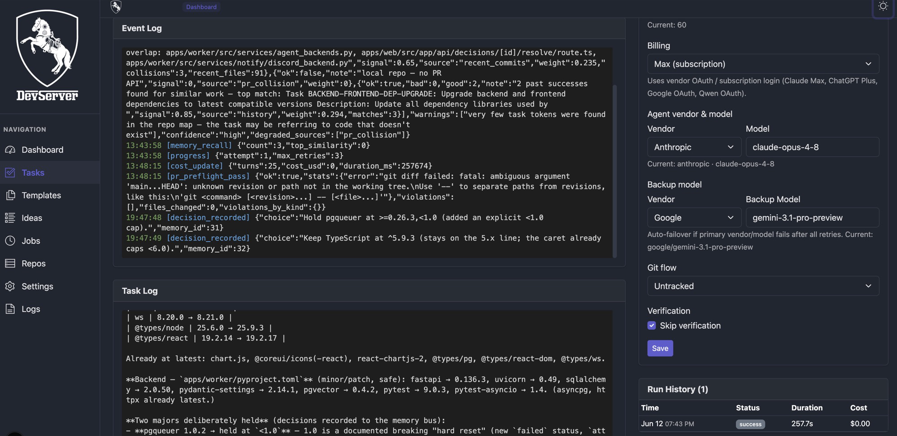
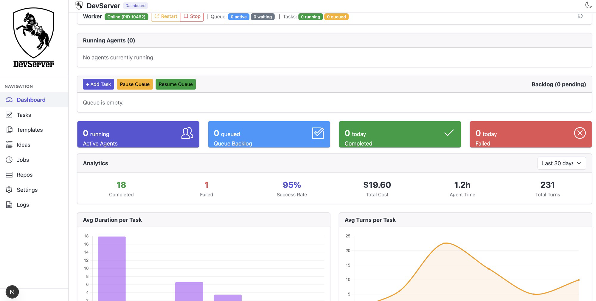
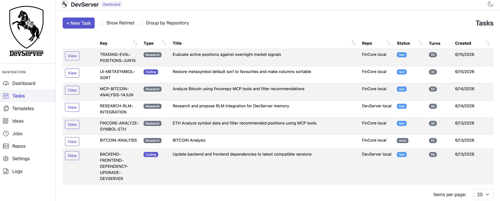
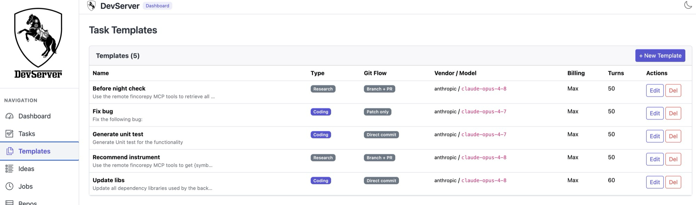
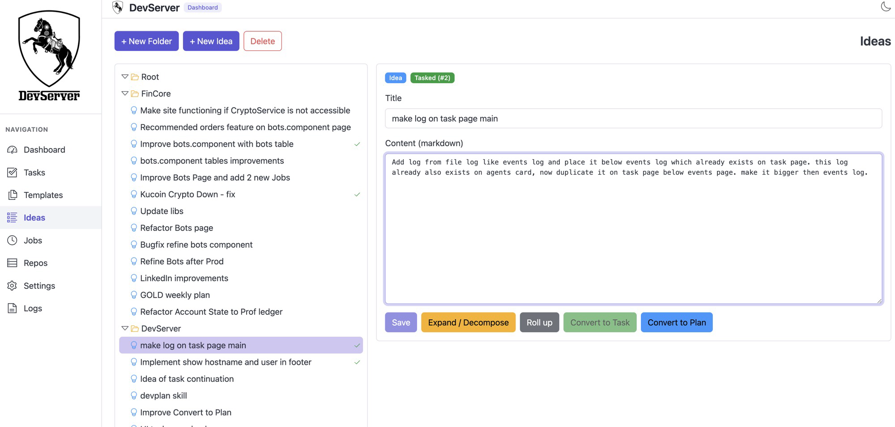
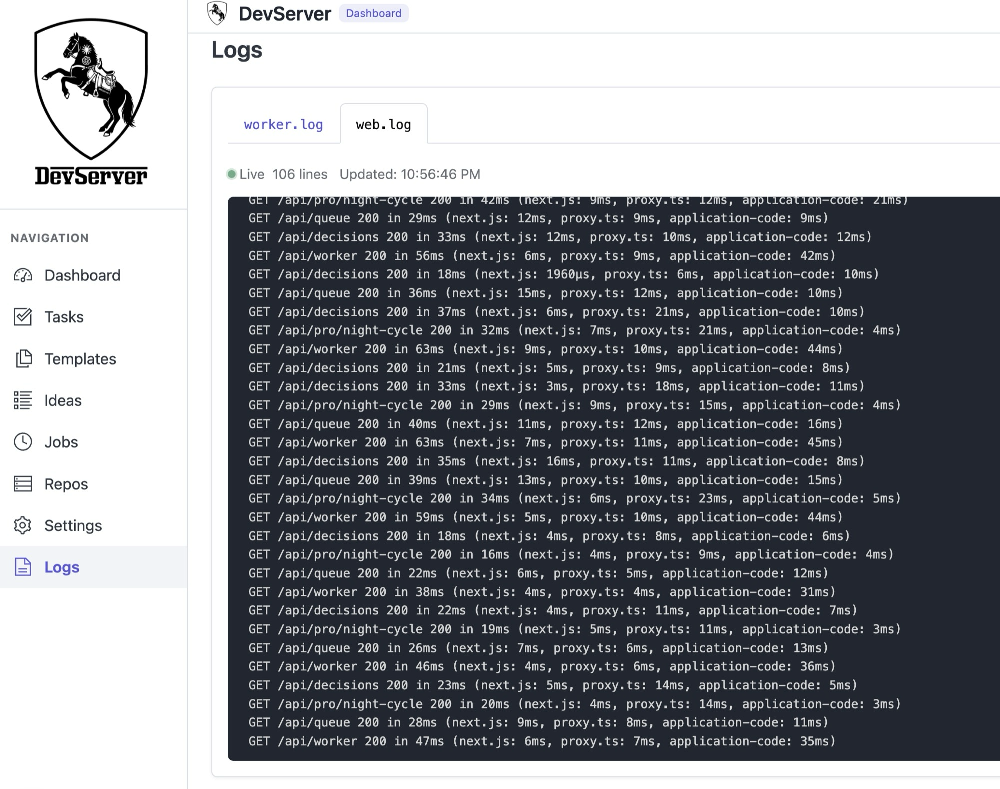
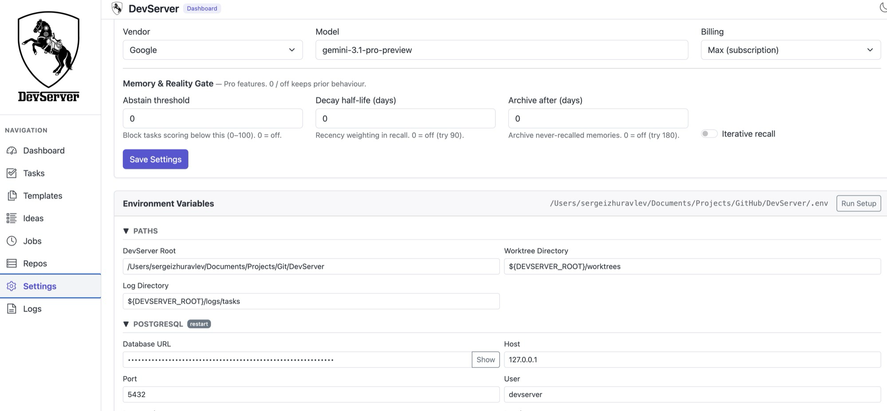
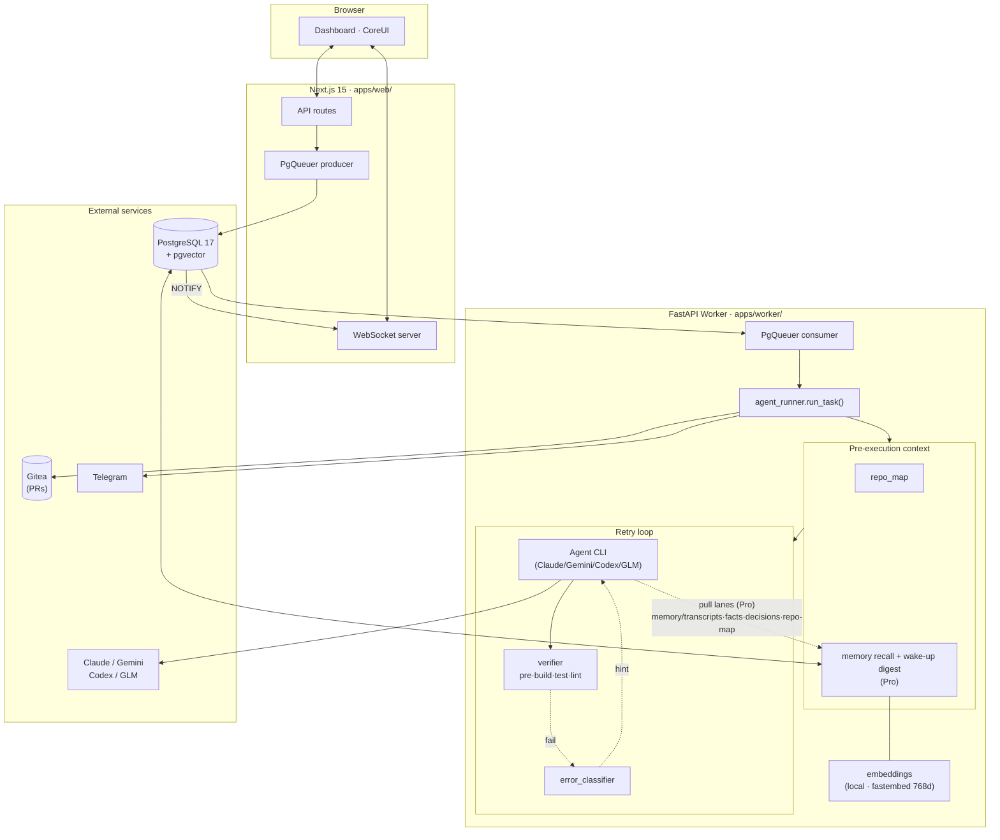

<div align="center">


# DevServer

### An autonomous coding pipeline for AI coding agents.

**Dispatches coding tasks → runs the agent in an isolated git worktree → verifies build/test/lint → opens a pull request on Gitea or GitHub. Or point it at any local git folder — no remote, no tokens, works with every git provider.**

[](LICENSE)
[](https://nextjs.org/)
[](https://react.dev/)
[](https://python.org/)
[](https://fastapi.tiangolo.com/)
[](https://postgresql.org/)
[](docker/)



[Why](#why-devserver) · [Features](#features) · [Architecture](#architecture) · [Design Decisions](#design-decisions) · [Quick Start](#quick-start) · [Project Layout](#project-layout) · [Pro Edition](#pro-edition) · [Roadmap](#roadmap)

</div>

---

## 🐎 Three thoroughbreds. No saddle, no harness.


**Claude. Gemini. ChatGPT.** Three of the most powerful minds ever built — and on their own, that's exactly what they are: magnificent animals standing in a field. You copy-paste between chat tabs, babysit half-finished diffs, lose all context the second you switch models, and nothing actually *ships* while you watch.

Raw horsepower isn't speed. **Speed needs a harness.**

## 🏇 Saddle up. This is DevServer.


DevServer is the **full harness for your AI providers** — saddle, reins, and stirrups for Claude, Gemini, *and* ChatGPT, all at once. Hand it a task and it dispatches the right agent into an isolated git worktree, verifies build/test/lint, and opens the pull request for you. Rate-limited? It fails over to another vendor mid-stride. Drifting off course? Reality checks, plan gates, and per-repo memory keep it on the track.

One platform. Every model. **Ride your AI at Ferrari style — and Ferrari speed.**

➡️ Point it at any repo and let it run → **[Quick Start](#quick-start)**

---

## Why DevServer?

Most autonomous coding agents ship as a closed SaaS, a VS Code extension, or a CLI glued to GitHub. DevServer is the opposite: a **self-hosted orchestration platform** for people who already run their own infrastructure and want agents to work on their terms.

- **Multi-vendor agent backends.** Run tasks on Claude (Anthropic), Gemini via Google's Antigravity CLI, Codex (OpenAI), or GLM (Zhipu AI) — including the models **Claude Sonnet 5**, **Claude Fable 5**, and **Gemini 3.5 Pro**. Each vendor has a dedicated backend — switch per task via the dashboard. Auto-failover between vendors when rate limits or errors exhaust retries.
- **Pay by API key or by subscription.** Per-task billing mode: `api` (metered key) or `max` (flat-rate subscription). Subscription mode works across vendors — Claude **Max**, ChatGPT **Plus** (Codex), and Google **AI Pro / Ultra** (via the Antigravity CLI) — by falling back to the CLI's own OAuth login instead of an API key.
- **Outcome forecast.** Before a task runs, see a success-probability and expected duration/turns estimate from your repo's history. Free uses a repo-level baseline; Pro upgrades it to similar-task matching via pgvector.
- **Error-class-aware retries.** Failures are classified by 20+ regex rules (import errors, TS compile errors, test failures, merge conflicts, ...) and the next attempt receives a surgical remediation hint. Recurring hard errors *escalate* instead of burning retries.
- **Multi-language repo map.** Before any code is written, the worker builds a regex-based symbol index (classes, functions, types) for 11 languages, so the agent starts with an accurate picture of the codebase.
- **Dashboard with analytics.** Live counts, today's stats, per-vendor cost breakdown, average duration and turns-per-task charts, governance KPIs (**cost per PR**, **abstain savings**), and a period selector for 7–90 days of history.
- **Pipeline board.** A kanban projection of the task list — lifecycle-native lanes (Queued / Active / Needs You / Shipped / Stalled) with live websocket transitions, evidence chips, and inline actions. Toggle Grid ⇄ Board on the Tasks page; no separate route.
- **Architecture diagram.** One click renders a Mermaid module-tree diagram of any repo, generated deterministically from the repo map — no LLM call, no cost.
- **Task templates.** Saved presets for repetitive work ("fix lint errors", "add unit tests", "update deps") with pre-filled descriptions, acceptance criteria, and agent settings.
- **Full live observability.** PG `NOTIFY` → WebSocket → dashboard. Every agent step is a typed event on a live timeline — no page refresh, no polling.
- **Governance-grade OpenTelemetry.** Opt-in OTLP export of the whole task pipeline as spans carrying DevServer-only attributes (reality score, budget burn, secret-scan hits, error class, vendor failover) to any collector — Langfuse, Grafana Tempo, Datadog, Jaeger. Zero overhead when unset.
- **Telegram notifications.** Basic task start/success/fail alerts so you know what happened while you were away.

All of the above are real code paths, not marketing bullets. See [`apps/worker/src/services/`](apps/worker/src/services/) for the implementations.

> **Looking for advanced features?** Reality gate, pgvector memory, interactive plan approval, budget circuit breaker, PR secret scanning, patch export, night cycle, inter-task messaging bus + operator inbox, and webhook triggers are available in the [Pro edition](README.PRO.md).

## Features

### Dashboard — what's running, what's queued, what cost what

<a href="assets/dashboard.png"></a>

The landing page. Top: worker status bar with online/offline indicator, queue depth, and active/pending/running task counts. Middle: running agents list and queue control toolbar (Add Task, Pause Queue, Resume Queue). Below: colour-coded stat cards (running, queued, completed today, failed today). **Analytics** section with a summary row (completed, failed, success rate %, total cost, agent time, total turns) plus two governance KPIs neither competitor surfaces — **Cost / PR** (average LLM spend per pull request) and **Abstain Savings** (spend avoided on tasks the reality gate refused to start) — and Avg Duration per Task (bar) and Avg Turns per Task (line) charts, configurable from 7 to 90 days. Everything updates in real time over the WebSocket.

📂 [`apps/web/src/components/Dashboard.tsx`](apps/web/src/components/Dashboard.tsx) · [`apps/web/src/components/DashboardCharts.tsx`](apps/web/src/components/DashboardCharts.tsx)

---

### Tasks — the full backlog with status and priority

<a href="assets/tasks.png"></a>

The full task backlog. Columns: colour-coded priority badge, task key, title, repo, status badge, turns used, and created date. Filter by status (`pending` / `queued` / `running` / `verifying` / `test` / `failed` / `blocked` / `cancelled`), toggle retired tasks, and paginate with items-per-page selector. Each row links to the task detail view. The **+ New Task** button opens the creation form with an optional template picker. An **Import** button pulls Confluence pages straight into the backlog (see *Import from Confluence* below), and grid rows carry checkboxes for **bulk retire** — select any number of tasks across repo groups and retire them in one click.

A **Grid ⇄ Board** toggle switches the same data between the table and a **Pipeline Board** — a kanban projection with lifecycle-native lanes (**Queued / Active / Needs You / Shipped / Stalled**). Cards carry a vendor badge, priority flag, reality-score chip, and inline actions (Enqueue / Cancel / Continue); lanes transition live over the websocket with no polling, and filters cover repo / vendor / "needs you only". A **"Needs You"** count pill on the sidebar surfaces tasks awaiting a human decision.

📂 [`apps/web/src/app/tasks/page.tsx`](apps/web/src/app/tasks/page.tsx) · [`apps/web/src/components/TaskTable.tsx`](apps/web/src/components/TaskTable.tsx) · [`apps/web/src/components/PipelineBoard.tsx`](apps/web/src/components/PipelineBoard.tsx)

---

### Task Detail — events, runs, agent settings

<a href="assets/viewtask.png"></a>

The single most information-dense view in the product. From left:

- **Live event log** — every agent step (`repo_map_built`, `reality_signal`, `error_classified`, `pr_preflight_pass`, `rate_limit_backoff`, `vendor_failover`) as it streams in over PG `NOTIFY` → WebSocket.
- **Task log** — real-time tail of the per-task log file with run result, diff stats, and `git am`-ready output.
- **Agent settings sidebar** — per-task overrides for billing mode (API / Max subscription), vendor + model picker, backup vendor + model for auto-failover, git flow (Branch + PR / Direct commit / Patch only — Local Git repos offer Untracked changes / Patch only instead), verification toggle, and a Save button.
- **Patches panel** — commit count, diff stats (files changed, lines added/removed), generated-at timestamp, and a prominent **Download combined.mbox** button.

📂 [`apps/web/src/app/tasks/[id]/page.tsx`](apps/web/src/app/tasks/[id]/page.tsx) · [`apps/web/src/components/TaskDetail.tsx`](apps/web/src/components/TaskDetail.tsx)

---

### Task Templates — saved presets for repetitive work

<a href="assets/templates.png"></a>

Create reusable templates with pre-filled descriptions, acceptance criteria, agent vendor/model, git flow, billing mode, max turns, and all other agent settings. The template table shows name, git flow badge (Direct commit / Branch + PR), vendor/model, billing mode, and max turns at a glance. When creating a new task, pick a template from the dropdown and the form is pre-filled instantly.

📂 [`apps/web/src/app/templates/page.tsx`](apps/web/src/app/templates/page.tsx) · [`apps/web/src/components/TemplateList.tsx`](apps/web/src/components/TemplateList.tsx)

---

### Ideas — hierarchical brainstorm tree, convertible to tasks

<a href="assets/ideas.png"></a>

A lightweight brainstorm space. Folders contain other folders or **idea leaves** (markdown content). Reorganise the tree by **drag-and-drop** — drop an idea onto a folder (or the empty root area) to reparent it, with cycle-safe validation and optimistic updates. When an idea is ready, click *Convert to Task* and it lands in the tasks backlog with the description pre-populated. Idea → task linkage is preserved in the database. An **Import** button brings Confluence pages in as ideas.

📂 [`apps/web/src/app/ideas/page.tsx`](apps/web/src/app/ideas/page.tsx) · [`apps/web/src/components/IdeasView.tsx`](apps/web/src/components/IdeasView.tsx)

---

### Import from Confluence — pages become Tasks or Ideas

A shared **Import** dialog on the Tasks and Ideas pages pulls documentation straight out of Confluence: pick the source, search by text or raw CQL (with an optional Space filter), tick the pages you want, preview the converted Markdown, then map them to **Tasks** (choose repo, priority, optional auto-enqueue) or **Ideas** (lands at the tree root).

- **Cloud and Data Center/Server** are both supported — email + API token (Basic auth) for Cloud, Personal Access Token (Bearer) for DC; the `/wiki` suffix is added automatically for `*.atlassian.net`.
- **Global or per-repo credentials** — configure once in Settings (stored in `.env`, never in the database), or give a repo its own Confluence connection override.
- **Idempotent re-imports** — an `external_imports` ledger maps each page to its target; unchanged versions are skipped, changed ones update the existing task/idea in place. Never duplicated.
- **Storage-format → Markdown** conversion (headings, lists, code macros, tables, links) with zero new dependencies, and the framework is pluggable — Confluence is the first source adapter.

📂 [`apps/web/src/components/ImportModal.tsx`](apps/web/src/components/ImportModal.tsx) · [`apps/worker/src/services/import_sources/`](apps/worker/src/services/import_sources/)

---

### Logs — live tail of worker and web process output

<a href="assets/logs.png"></a>

A real-time log viewer with two tabs — `worker.log` and `web.log` — polled every 1.5 seconds. Lines are colour-coded by severity (ERROR red, WARNING yellow, INFO blue, DEBUG green). Auto-scrolls to the bottom; a jump-to-bottom button appears when you scroll up.

📂 [`apps/web/src/app/logs/page.tsx`](apps/web/src/app/logs/page.tsx) · [`apps/web/src/components/LogsView.tsx`](apps/web/src/components/LogsView.tsx)

---

### Settings — global queue, system LLM, and environment variables

<a href="assets/settings.png"></a>

A single-page control panel for the worker's global behaviour. **General** card: max concurrency (1–10), queue-paused and auto-enqueue toggles, Telegram notification toggle, the **System LLM** vendor + model picker (used by Fill Task and DevPlan), and a **Memory & Reality Gate** row (abstain threshold, memory decay half-life, archive window, iterative-recall toggle — all default to off so behaviour is unchanged until you opt in). **Environment Variables** card: live view of the `.env` file path, database connection details (host, port, user, database), and masked API keys with a Show/Hide toggle — plus a **Run Setup** button to re-run the interactive `.env` wizard. A **Confluence** card configures the global external-import connection (base URL, username/email, API token or PAT) with a one-click **Ping** connectivity test; values are written to `.env` and hot-reloaded into the running worker.

📂 [`apps/web/src/app/settings/page.tsx`](apps/web/src/app/settings/page.tsx) · [`apps/web/src/components/SettingsForm.tsx`](apps/web/src/components/SettingsForm.tsx)

---

### Repositories — Gitea, GitHub, or any local git folder

Three repository types, selected per repo:

- **Gitea / Forgejo** — clones over HTTPS with a per-repo or global token, opens PRs through the Gitea REST API.
- **GitHub** — same pipeline with GitHub-correct auth (`x-access-token` works for classic PATs, fine-grained PATs and App tokens alike) and the GitHub PR API. GitHub Enterprise Server is supported too.
- **Local Git** — defined by a **Local Root Folder** instead of a clone URL. DevServer runs git directly inside that folder: no clone, no worktree copy, no tokens, and — by hard guarantee — **no push, ever**.

Why Local Git matters: it makes DevServer **provider-agnostic**. Clone a repo from **GitHub, GitLab, Bitbucket, Azure DevOps, a private bare repo on a NAS — anything** — and point DevServer at the folder. Since all work happens against the local clone, there is no host API to integrate, no token to provision, and nothing ever leaves your machine. Two git flows fit this model:

- **Untracked changes** — the agent only edits files in your working tree. No branch, no commit, no push; you review the diff with your normal tools and commit it yourself.
- **Patch only** — the agent commits on a local `agent/…` branch (your original branch is restored afterwards) and the changes are exported as a `combined.mbox` you can `git am` anywhere.

Safety guarantees for your folder: DevServer never hard-resets or cleans it, refuses to start a patch-flow task on a dirty working tree (so your own uncommitted work can never be swept into agent commits), and the agent is explicitly instructed to never touch remotes. Local repos show a turquoise **Local** badge on the Repos page.

📂 [`apps/worker/src/services/git_ops.py`](apps/worker/src/services/git_ops.py) · [`apps/web/src/components/RepoForm.tsx`](apps/web/src/components/RepoForm.tsx)

---

### Architecture diagram — instant module map, no LLM

Each repo on the Repos page has a **Diagram** button that opens a full-screen, scrollable **Mermaid** flowchart of the repo's module tree. It's generated deterministically from the same directory walk as the repo map (`build_mermaid`) — no LLM call, no token cost, regenerates instantly — so you get a current architecture picture for free, on demand.

📂 [`apps/worker/src/services/repo_map.py`](apps/worker/src/services/repo_map.py) (`build_mermaid`) · [`apps/web/src/components/RepoDiagramModal.tsx`](apps/web/src/components/RepoDiagramModal.tsx)

---

### Jobs — cron schedules that re-run tasks

A schedule binds a name + cron expression (`@hourly`, `@daily`, `every 30m`, `every 2h`, `HH:MM` UTC) to an **existing task**. On every fire the task is reset to pending and enqueued through the normal pipeline; a task that is already queued or running is left alone — no double-runs. Run history lands in the task's own runs/events, so there is nothing extra to monitor.

📂 [`apps/web/src/components/SchedulesPanel.tsx`](apps/web/src/components/SchedulesPanel.tsx) · [`apps/worker/src/services/scheduler.py`](apps/worker/src/services/scheduler.py)

## Architecture


```mermaid
flowchart TB
  subgraph browser["Browser"]
    Dash["Dashboard · CoreUI"]
  end

  subgraph web["Next.js 15 · apps/web/"]
    API["API routes"]
    WS["WebSocket server"]
    Prod["PgQueuer producer"]
  end

  subgraph worker["FastAPI Worker · apps/worker/"]
    Cons["PgQueuer consumer"]
    Runner["agent_runner.run_task()"]
    Emb["embeddings<br/>(local · fastembed 768d)"]
    subgraph ctx["Pre-execution context"]
      direction LR
      RM["repo_map"]
      KB["memory recall + wake-up digest<br/>(Pro)"]
    end
    subgraph loop["Retry loop"]
      direction LR
      CLI["Agent CLI<br/>(Claude/Gemini/Codex/GLM)"]
      VER["verifier<br/>pre·build·test·lint"]
      EC["error_classifier"]
      CLI --> VER
      VER -.fail.-> EC -.hint.-> CLI
    end
    Runner --> ctx --> loop
    CLI -. "pull lanes (Pro)<br/>memory/transcripts·facts·decisions·repo-map" .-> KB
    KB --- Emb
  end

  subgraph ext["External services"]
    direction TB
    Gitea[("Gitea<br/>(PRs)")]
    PG2[("PostgreSQL 17<br/>+ pgvector")]
    TG["Telegram"]
    Agents["Claude / Gemini<br/>Codex / GLM"]
  end

  Dash <--> API
  Dash <--> WS
  API --> Prod --> PG2
  PG2 --> Cons --> Runner
  PG2 -- NOTIFY --> WS
  KB <--> PG2
  Runner --> Gitea
  Runner --> TG
  CLI --> Agents
```

Three small services, one shared PostgreSQL. No Redis, no RabbitMQ, no Celery — **PgQueuer** uses the same database everything else lives in.

## Design Decisions

### 1. Multi-vendor agent backends

DevServer isn't locked to one AI provider. The `AgentBackend` abstraction covers four vendors out of the box:

| Vendor | CLI Binary | Latest models | Status |
|---|---|---|---|
| `anthropic` | `claude` | **Claude Sonnet 5** (default), Opus 5, Fable 5, Opus 4.8, Haiku 4.5 | Production-tested |
| `google` | `agy` | **Gemini 3.1 Pro** (default, High/Low), Gemini 3.6 Flash, Gemini 3.5 Flash (via the Antigravity CLI) | Verified (agy 1.1.7) |
| `openai` | `codex` | GPT-5.6 Sol / Terra / Luna, GPT-5.5, GPT-5.4, GPT-5.3 Codex | Structurally complete |
| `glm` | `claude` | GLM-5.2 / 5.1 / 5 Turbo — runs the Claude CLI against Zhipu's Anthropic-compatible API | Production-tested |

Each task carries `agent_vendor`, `claude_model`, and `claude_mode` (billing mode: `api` or `max`). The worker dispatches to the right backend automatically. Adding a new vendor is ~30 lines of Python.

> **Note — Google migrated to the Antigravity CLI.** Google retired the Gemini CLI on 2026-06-18 (`gemini` commands now return *410 Gone*). The Google backend now drives Google's replacement, the **Antigravity CLI** (`agy`), reusing the same Gemini API key and Google AI Pro/Ultra subscription. Install with `curl -fsSL https://antigravity.google/cli/install.sh | bash`.

**Billing modes are vendor-agnostic.** `api` inherits the vendor's API-key env var; `max` strips it so the CLI uses its own subscription login. That means you can run a task on **Claude Max**, **ChatGPT Plus** (`codex login`), or **Google AI Pro / Ultra** without per-token metering. For Google, sign in once with `agy` (the Google account holding the subscription), set the task's billing to **Max**, and pick `gemini-3.1-pro-high`. In `api` mode the worker reuses your existing `GEMINI_API_KEY` (bridged to `ANTIGRAVITY_API_KEY`).

📂 [`apps/worker/src/services/agent_backends.py`](apps/worker/src/services/agent_backends.py)

### 2. Auto-failover between vendors

Each task can have a `backup_vendor` and `backup_model`. When the primary vendor exhausts all retries (including rate-limit backoff), the runner automatically switches:

- Resets to the backup vendor's `AgentBackend`
- Clears the session (sessions can't be resumed cross-vendor)
- Commits any in-progress work
- Runs a fresh retry loop with the backup vendor/model

This means a rate-limited Anthropic task can transparently continue on GLM or Google — no manual intervention.

### 3. Error-class-aware retries, not blanket re-runs

The naive "append stderr, retry" loop costs a full Claude session per attempt. DevServer runs verifier/agent output through 20 regex rules spanning Python, TypeScript / Node, C# / .NET, Rust, Go, Java, Git, and shell. Each matched rule produces a structured `ErrorClass(key, hint, severity)`:

- **`recoverable`** errors (import error, test failure, TS compile error) inject a surgical remediation hint into the next retry's prompt.
- **`hard`** errors (merge conflict, `git nothing to commit`, `command not found`, permission denied) escalate immediately — no more retries.
- A `recoverable` class that repeats across two attempts escalates too, on the theory that "same error twice" means the agent is stuck.

📂 [`apps/worker/src/services/error_classifier.py`](apps/worker/src/services/error_classifier.py)

### 4. Multi-language repo map

Before any agent subprocess starts, the worker builds a regex-based symbol index covering classes, functions, and types across 11 languages. This ~4 KB block in the prompt eliminates "file not found" retries by giving the agent an accurate picture of what exists and where.

📂 [`apps/worker/src/services/repo_map.py`](apps/worker/src/services/repo_map.py)

### 5. Rate-limit hardening

Concurrent tasks hitting vendor rate limits are handled at two levels:

1. **Per-subprocess 429 backoff** — a rate-limit failure inside `_run_claude` is retried with exponential backoff (30s, 60s, 120s + jitter) without consuming a task-level retry.
2. **Minimal retry prompts** — resumed sessions receive only the error/remediation block, not the full context again, cutting per-retry token usage by ~50%.

📂 [`apps/worker/src/services/agent_runner.py`](apps/worker/src/services/agent_runner.py)

### 6. Governance-grade OpenTelemetry (opt-in)

DevServer can export its entire task pipeline as OpenTelemetry spans to any OTLP collector (Langfuse, Grafana Tempo, Datadog, Jaeger). It's wired at the **single `_emit_event` chokepoint** every task event already flows through, so one wrapper covers all ~16 event types: a per-task root span is opened at task start, each event becomes a span event, and the run closes at the terminal status. Beyond the standard GenAI attributes (`gen_ai.system`, `gen_ai.request.model`, `gen_ai.usage.*`), spans carry **DevServer-only governance attributes** — `devserver.reality_score`, `devserver.budget.cost_usd` / `.wall_seconds`, `devserver.preflight.secret_hits`, `devserver.error_class`, `devserver.vendor_failover`, `devserver.final_status` — the richest agent telemetry, in your own stack.

It is **fully opt-in and zero-overhead**: a no-op unless `OTEL_EXPORTER_OTLP_ENDPOINT` is set *and* the optional `otel` extra is installed (`uv sync --extra otel`), so deployments that don't use it pay nothing.

📂 [`apps/worker/src/services/telemetry.py`](apps/worker/src/services/telemetry.py)

## Tech Stack

| Layer | Choice | Why |
|---|---|---|
| **Frontend** | Next.js 15 App Router · React 19 · CoreUI Pro | Server components for task pages, client components for real-time panels. |
| **Backend worker** | Python 3.12 · FastAPI · SQLAlchemy 2.0 async · asyncpg | Async from top to bottom — every subprocess, DB call, and agent invocation is non-blocking. |
| **Job queue** | [PgQueuer](https://github.com/janbjorge/pgqueuer) | PostgreSQL-native queue. No Redis, no RabbitMQ — one fewer service to monitor. |
| **Database** | PostgreSQL 17 | Relational truth + queue + real-time notifications in one store. |
| **Real-time** | `LISTEN/NOTIFY` → WebSocket | Zero-dependency pub/sub. Dashboard updates arrive within ~100 ms. |
| **AI engines** | Claude, Gemini, Codex, GLM CLIs | DevServer *orchestrates* existing CLIs instead of reimplementing agent logic. |
| **Embeddings** | `fastembed` (local, ONNX/CPU) | Local semantic embeddings for Pro memory recall — no cloud API, no key. Default `BAAI/bge-base-en-v1.5` (768-dim), override via `EMBEDDING_MODEL`. |
| **Git platform** | Gitea / Forgejo / GitHub / Local Git | Gitea and GitHub get PRs via their REST APIs; Local Git repos work on a plain local clone — any provider, no API, no tokens. |
| **Notifications** | Telegram Bot API | Basic task lifecycle alerts. |
| **Charts** | Chart.js + react-chartjs-2 | Lightweight, no-frills analytics visualizations. |
| **Package mgmt** | `uv` (Python) · `npm` (Node) | Fast, cacheable, boring. |

## Quick Start

### Prerequisites

- Node.js >= 22 LTS
- Python >= 3.12
- PostgreSQL >= 16
- At least one agent CLI installed and authenticated (e.g. `claude login`)
- `uv` for Python dependency management — [install guide](https://docs.astral.sh/uv/)
- A Gitea (or Forgejo) instance with a personal access token — or skip the git host entirely and use a **Local Git** repo (any local clone, no token needed)

### Local setup (host processes)

```bash
git clone https://github.com/<YOUR_GITHUB_HANDLE>/DevServer.git
cd DevServer
cp config/.env.example .env
# edit .env — fill in PGPASSWORD, GITEA_TOKEN, TELEGRAM_*, ANTHROPIC_API_KEY

./scripts/migrate.sh          # runs all SQL migrations
./scripts/start.sh --dev      # starts worker + web in dev mode
```

The dashboard is now at **http://localhost:3200** (configurable via `WEB_PORT` in `.env`).

> **On Windows?** Use the PowerShell scripts (`scripts\setup-local.ps1`,
> `scripts\start.ps1`) instead of the `.sh` ones — see [Windows](#windows).

### Upgrading an existing install

The whole schema lives in one idempotent migration, so upgrading an
existing database is just:

```bash
./scripts/migrate.sh   # safe to re-run; only applies what's missing
```

This adds the latest memory tables/columns and reshapes the
`agent_memory.embedding` column to the local-embedding dimension (768).
**Pro users** then backfill embeddings with the local model (the reshape
drops the old vectors):

```bash
cd apps/worker && uv run python scripts/reembed_memory.py
```

`fastembed` is a worker dependency now; the embedding model downloads on
first use (the Docker image pre-bakes it). No embedding API key is required.
See [README.PRO.md](README.PRO.md#migrating-an-existing-postgres-database-memory-kb)
for the full memory-KB upgrade + usage guide.

### Docker (recommended for production)

Use the lifecycle scripts — they read the repo-root `.env`, select the right
compose file/topology, and enable the bundled-database profile for you:

```bash
cp config/.env.example .env
# edit .env — minimum: PGPASSWORD, ANTHROPIC_API_KEY

./scripts/build.sh --docker
./scripts/start.sh --docker
```

The bundled `pgvector/pgvector:pg17` database runs under a compose **profile**
(`bundled-db`) so it can be skipped for Host-OS / External database modes. If
you invoke `docker compose` directly instead of the scripts, you must therefore
(a) pass `--profile bundled-db` to start the bundled DB, and (b) make the
repo-root `.env` visible to compose (the scripts `source` it; raw compose reads
only a `.env` in the current dir), e.g.:

```bash
cd docker
set -a && . ../.env && set +a            # export root .env for ${VAR} interpolation
docker compose --profile bundled-db up -d --build
```

This runs out of the box on Linux, macOS, and Windows.

**Two topologies — where do the agent CLIs run?** The worker shells out to a
vendor CLI (`claude` / `agy` / `codex` — GLM also uses `claude`) for every
task, and *where the worker runs* decides where those CLIs run:

| Topology | Compose file | Agent CLIs run… | Auth |
|---|---|---|---|
| **All-in-Docker** (default) | `docker-compose.yml` | inside the worker container (baked into the image) | API keys via `.env`; for `max` subscription mode, mount your host `~/.claude` (see below) |
| **Worker on host** | `docker-compose.host-worker.yml` | as host processes | your existing host logins (`claude login`, `codex login`, `agy` Google OAuth, GLM key) — nothing to install or mount |

Pick **worker-on-host** if you want the agents to use the subscription logins
already set up on your machine; pick **all-in-Docker** for a single portable
stack. Both are documented below.

#### Linux / macOS — host PostgreSQL (recommended)

If your host already runs PostgreSQL on port 5432, skip the bundled DB
with the host-DB override:

```bash
# If you previously ran the bundled-DB stack, tear it down first
docker compose down

docker compose -f docker-compose.yml -f docker-compose.host-db.yml up -d --build
```

On Docker Desktop (macOS) `host.docker.internal` is built in; on Linux
it is mapped through the compose override via `host-gateway`.

**Linux host Postgres prerequisites** (one-time):

1. `postgresql.conf` — add the docker bridge gateway to `listen_addresses`
   (check yours with `ip addr show docker0`, default is `172.17.0.1`):
   ```
   listen_addresses = 'localhost,172.17.0.1'
   ```
2. `pg_hba.conf` — allow the docker bridge subnet:
   ```
   host    devserver    devserver    172.16.0.0/12    scram-sha-256
   ```
3. `sudo systemctl reload postgresql` (listen_addresses needs a full
   restart: `sudo systemctl restart postgresql`).

**macOS host Postgres prerequisites** (one-time, Homebrew install):

1. `postgresql.conf` (usually `/opt/homebrew/var/postgresql@17/postgresql.conf`):
   ```
   listen_addresses = '*'
   ```
2. `pg_hba.conf` — allow the Docker Desktop VM subnet:
   ```
   host    devserver    devserver    192.168.65.0/24    scram-sha-256
   host    devserver    devserver    127.0.0.1/32       scram-sha-256
   ```
3. `brew services restart postgresql@17`.

Make sure the `vector` extension is installed on the host Postgres — on
macOS: `brew install pgvector` then `CREATE EXTENSION IF NOT EXISTS vector;`
in the `devserver` database.

#### Worker on host (run AI providers from your host OS)

Use this when you want the agents to run on your machine with the
subscription logins you already set up (`claude login`, `codex login`, the
`agy` Google OAuth, GLM key) instead of in a container. Postgres + the web
dashboard stay in Docker; only the Python worker runs natively.

```bash
# 1. DB + web in Docker (no worker container)
cd docker
docker compose -f docker-compose.host-worker.yml up -d --build

# 2. Worker on the host (new terminal, repo root)
cd apps/worker
cp ../../config/.env.example .env     # already host-shaped — then edit it
uv run uvicorn src.main:app --host 0.0.0.0 --port 8000
```

How the boundary is bridged (handled by the compose file):

- **web → worker**: the containerised dashboard reaches the host worker at
  `host.docker.internal:8000` (`WORKER_URL`). Built in on Docker Desktop;
  mapped via `host-gateway` for Linux.
- **worker → DB**: the DB port is published, so the host worker connects on
  `localhost:5432`.
- **logs**: web bind-mounts `<repo>/logs`, so the dashboard `/logs` viewer
  reads the host worker's log files.

Two `.env` values must match this layout:

- `DATABASE_URL` must point at `127.0.0.1:5432` (the published DB port) — the
  `postgres` service name only resolves *inside* Docker.
- `DEVSERVER_ROOT` must be the repo root so `LOG_DIR=${DEVSERVER_ROOT}/logs/tasks`
  lines up with the log dir web mounts.

In this mode the worker is not root, so the Claude/GLM
`--dangerously-skip-permissions` root restriction never triggers, and no agent
CLIs are installed into any image.

**Lifecycle scripts default to this topology.** `./scripts/build.sh --docker`,
`start.sh --docker`, `restart.sh --docker`, and `stop.sh --docker` all use
`docker-compose.host-worker.yml` and manage the host worker for you (build its
venv, start/stop the process). To run the all-in-Docker stack via the scripts
instead, set `DEVSERVER_COMPOSE=all-in-docker`:

```bash
DEVSERVER_COMPOSE=all-in-docker ./scripts/start.sh --docker
```

**Choosing the database (Settings → Database, or the Setup wizard).** In a
Docker deployment the Database card offers three options — **Docker PostgreSQL
(bundled)**, **Host OS PostgreSQL**, or **External host / credentials** (a
host build offers just *local default* vs *custom host/creds*). The card writes
the connection to `.env` and, for the non-bundled options, sets
`DEVSERVER_HOST_DB=1` plus the container-perspective `PGHOST_CONTAINER` /
`PGPORT_CONTAINER` so the web (and, in all-in-Docker, worker) **containers**
reach the right database — not just the host worker. The bundled `postgres`
container lives behind a `bundled-db` compose profile, so picking Host-OS /
External skips it entirely. A worker/web restart applies the change.

#### Max subscription (Claude OAuth) inside Docker

For the **all-in-Docker** topology, `max` (subscription) mode needs the OAuth
login from `claude login` — which lives in your host home dir. Run
`claude login` on the host once, then mount the config dir read-only by
uncommenting this line under the `worker` service in `docker-compose.yml`:

```yaml
    # - ${CLAUDE_CONFIG_DIR:-${HOME}/.claude}:/root/.claude:ro
```

Leave `ANTHROPIC_API_KEY` empty in `.env` so the CLI falls back to the mounted
login. (The worker-on-host topology above needs none of this — it uses your
host login directly.)

> **Windows:** `${HOME}` is not set for `docker compose` on native Windows, so
> the default above resolves to an invalid path. Set `CLAUDE_CONFIG_DIR` in
> `.env` to your host config dir using forward slashes —
> `CLAUDE_CONFIG_DIR=C:/Users/<you>/.claude` — before uncommenting the mount.

### Windows

Windows is a first-class target. Every `scripts/*.sh` lifecycle script has a
PowerShell twin (`scripts/*.ps1`), so you can run DevServer **natively** (host
processes, no WSL or Docker required) or under **Docker Desktop** — your pick.
Use **PowerShell** (not CMD) for everything below.

> If a script is blocked by the execution policy, allow it for the current
> session only: `Set-ExecutionPolicy -Scope Process -ExecutionPolicy Bypass`.

#### Option A — Native (PowerShell, recommended for development)

Prerequisites: **Node.js 22+**, **Python 3.12+**, **PostgreSQL 16+**, **uv**
([install](https://docs.astral.sh/uv/)), and at least one agent CLI
(e.g. `npm install -g @anthropic-ai/claude-code` then `claude login`).

```powershell
git clone https://github.com/<YOUR_GITHUB_HANDLE>/DevServer.git
cd DevServer

.\scripts\setup-local.ps1     # 1st run: copies config\.env.example -> .env, then stops
notepad .env                  #          fill in PGPASSWORD and ANTHROPIC_API_KEY (minimum)
.\scripts\setup-local.ps1     # 2nd run: bootstraps the DB role+db, runs migrations, installs deps

.\scripts\start.ps1           # start worker + web (dev mode, hot reload)
```

Open **http://localhost:3200**. `setup-local.ps1` creates the `devserver`
PostgreSQL role and database for you on a fresh host — if your superuser isn't
passwordless, set `PGSUPERUSER` / `PGSUPERPASSWORD` in `.env` or enter the
superuser password when prompted.

Day-to-day commands (all accept `-Dev` (default), `-Prod`, or `-Docker`):

```powershell
.\scripts\start.ps1 -Prod     # production build (next build + node server.js)
.\scripts\stop.ps1            # stop host processes and free the ports
.\scripts\restart.ps1 -Prod   # tear everything down and restart cleanly in a mode
.\scripts\build.ps1 -Prod     # build only (no start)
```

Logs stream to `logs\worker.log` and `logs\web.log`
(`Get-Content logs\worker.log -Wait` to tail).

#### Option B — Docker Desktop

1. Install [Docker Desktop for Windows](https://www.docker.com/products/docker-desktop/)
   with the WSL 2 backend, and clone the repo to a path with no spaces.
2. Create and edit `.env` at the repo root:
   ```powershell
   Copy-Item config\.env.example .env
   notepad .env     # set PGPASSWORD and ANTHROPIC_API_KEY at minimum
   ```
3. Build and start with the lifecycle scripts (they pick the compose
   files/profiles and manage the host worker for you):
   ```powershell
   .\scripts\start.ps1 -Docker
   ```
4. Open **http://localhost:3200**. Stop with `.\scripts\stop.ps1 -Docker`.

**Claude Max (subscription) mode on Windows.** To use `max` billing instead of
an API key, run `claude login` on the host once. In **native** mode it just
works (the CLI uses your host login). In **Docker** mode set `CLAUDE_CONFIG_DIR`
in `.env` to your host config dir with forward slashes
(`CLAUDE_CONFIG_DIR=C:/Users/<you>/.claude`) and uncomment the `claude_auth`
mount in `docker-compose.yml` — the `${HOME}/.claude` default that works on
macOS/Linux does **not** resolve for `docker compose` on native Windows, so
`CLAUDE_CONFIG_DIR` is required there.

## Backup & Restore

DevServer includes scripts for full-system backup and restore:

```bash
# Backup — creates a timestamped archive in backups/
bash scripts/devserver-backup.sh

# Restore from archive
bash scripts/devserver-restore.sh backups/devserver-backup-YYYYMMDD-HHMMSS.tar.gz
```

Backups include: PostgreSQL dump, settings JSON, `.env`, worktrees, and logs.
Supports both local and Docker modes automatically.

## Project Layout

```
apps/
  web/                                → Next.js 15 frontend, API routes, PgQueuer producer, WebSocket server
    src/components/
      Dashboard.tsx                   → Dashboard with stats widgets and queue controls
      DashboardCharts.tsx             → Analytics charts + governance KPIs (cost/PR, abstain savings)
      TaskDetail.tsx                  → Task detail — events, logs, agent settings, run history
      TaskForm.tsx                    → Create/edit task form with template picker
      TaskTable.tsx                   → Task list with filters
      PipelineBoard.tsx               → Kanban board view (Grid ⇄ Board on the Tasks page)
      RepoDiagramModal.tsx            → Mermaid architecture diagram modal
      TemplateList.tsx                → Template CRUD management
      IdeasView.tsx                   → Hierarchical idea tree (drag-and-drop reparenting)
      ImportModal.tsx                 → Import from Confluence dialog (Tasks + Ideas)
      LogsView.tsx                    → Live log viewer
      SettingsForm.tsx                → Global settings editor (incl. Confluence connection)
    src/app/api/
      tasks/                          → Task CRUD + enqueue
      templates/                      → Template CRUD
      analytics/                      → Dashboard analytics data
      logs/                           → Log file streaming
      settings/                       → Worker settings read/write
  worker/                             → Python FastAPI worker + PgQueuer consumer
    src/services/
      _free_hooks.py                  → No-op stubs for pro features (always present)
      agent_runner.py                 → Main task execution loop with retry logic
      agent_backends.py               → Vendor abstraction (Claude, Gemini, Codex, GLM)
      repo_map.py                     → Multi-language symbol map + Mermaid diagram (build_mermaid)
      telemetry.py                    → Governance OpenTelemetry export (opt-in, OTLP)
      error_classifier.py             → 20 regex rules → targeted retry hints
      outcome.py                      → Repo-level outcome forecast (free baseline)
      app_settings.py                 → Typed reader for the key/value settings table
      llm_client.py                   → Vendor-agnostic system LLM client
      verifier.py                     → Pre/build/test/lint runner
      git_ops.py                      → Git worktree management, Gitea/GitHub PRs, local-folder repos
      queue_bridge.py                 → Worker → Next.js enqueue handoff (single queue producer)
      import_sources/                 → Pluggable external-import adapters (Confluence)
    src/routes/
      internal.py                     → Status, pause, cancel, generate-task, prediction, MCP task control
database/
  migrations/                         → Versioned SQL migrations (002 adds the external-import ledger)
config/
  .env.example                        → Sanitised environment template
docker/
  docker-compose.yml                  → Full stack deployment (Postgres + web + worker)
  docker-compose.host-worker.yml      → Postgres + web in Docker, worker on host
scripts/
  build.sh / start.sh / stop.sh / restart.sh  → Dev + prod + docker lifecycle helpers
  migrate.sh                          → Run database migrations
  devserver-backup.sh                 → Full-system backup
  devserver-restore.sh                → Restore from backup archive
```

## Pro Edition

DevServer ships as two editions:

| Feature | Free | Pro |
|---|:---:|:---:|
| Multi-vendor agent backends (Claude, Gemini, Codex, GLM) | ✅ | ✅ |
| Error-class-aware retries (20+ regex rules) | ✅ | ✅ |
| Multi-language repo map | ✅ | ✅ |
| Auto-failover between vendors | ✅ | ✅ |
| Rate-limit backoff (per-subprocess 429 handling) | ✅ | ✅ |
| Dashboard with analytics charts | ✅ | ✅ |
| Pipeline board (Grid ⇄ Board task view, live lanes) | ✅ | ✅ |
| Architecture diagram (Mermaid module tree, no LLM) | ✅ | ✅ |
| Governance analytics (cost-per-PR, abstain savings) | ✅ | ✅ |
| Governance OpenTelemetry export (OTLP, opt-in) | ✅ | ✅ |
| Task templates | ✅ | ✅ |
| Ideas brainstorm tree | ✅ | ✅ |
| Live log viewer | ✅ | ✅ |
| Settings / system LLM configuration | ✅ | ✅ |
| Basic Telegram notifications | ✅ | ✅ |
| Backup & restore scripts | ✅ | ✅ |
| Git worktree isolation + Gitea/GitHub PRs | ✅ | ✅ |
| Local Git repos (any provider's local clone — no remote, no tokens) | ✅ | ✅ |
| Cron schedules that re-run tasks | ✅ | ✅ |
| Full build/test/lint verifier | ✅ | ✅ |
| Outcome forecast (success probability + duration) | ✅ repo baseline | ✅ similar-task |
| Reality gate (0–100 evidence scoring) | — | ✅ |
| Strict abstain gate (block low-evidence tasks before they run) | — | ✅ |
| Per-repo memory knowledge base (past task recall) | — | ✅ |
| Local embeddings — fastembed, no cloud key (powers Pro memory) | ✅ infra | ✅ |
| Hybrid recall (vector + lexical RRF) + optional LLM rerank | — | ✅ |
| Verbatim transcript drawers + pre-compaction save | — | ✅ |
| Temporal facts + invalidation (knowledge-graph-lite) | — | ✅ |
| Topic scoping + cross-repo memory tunnels | — | ✅ |
| Wake-up digest + runtime agent memory diary | — | ✅ |
| Pull-on-demand memory lanes (transcripts/facts/decisions) + repo-map drill-down | — | ✅ |
| Memory recency decay + auto-archive | — | ✅ |
| Decision / causal memory (problem → choice → reasoning) | — | ✅ |
| Iterative multi-hop memory recall | — | ✅ |
| Interactive plan approval gate | — | ✅ |
| Per-task budget circuit breaker | — | ✅ |
| PR preflight (secret scan, allow-list, author check) | — | ✅ |
| Patch export (`git format-patch` + `combined.mbox`) | — | ✅ |
| Night cycle (autonomous overnight batch) | — | ✅ |
| Rich Telegram (inline keyboards) | — | ✅ |
| Inter-task messaging bus + operator inbox (secret-screened) | — | ✅ |
| Webhook triggers (Gitea/GitHub/Sentry/Grafana → task) | — | ✅ |
| Hardened Docker Compose (resource limits, log rotation, security) | — | ✅ |

The free edition compiles and runs without errors — the agent runner
gracefully degrades when pro modules are absent, falling back to no-op
stubs in `_free_hooks.py`.

See [README.PRO.md](README.PRO.md) for full Pro feature documentation.

## Roadmap

**Shipped.** Everything listed above is implemented and in production use.

**Intentionally deferred:**

- **Parallel sub-agents per task** — git worktrees are already per-task; sub-worktrees add complexity with unclear ROI at current scale.
- **Learned rules from review reactions** (Cursor Bugbot style) — requires a dashboard review surface DevServer doesn't expose yet.
- **Sandboxed container per task** (OpenHands style) — overlaps with the existing git worktree + `repo_locks` isolation.
- **Codebase-as-typed-graph** (Codegen style) — the repo map captures ~80% of the value at a small fraction of the effort.
- **Automated cross-repo apply** — today patches are generated for manual `git am`; automated second-worktree apply is the planned upgrade path.

Contributions and issues are welcome.

## License

[MIT](LICENSE) — free for personal and commercial use. Attribution appreciated but not required.

## Support / Donations

DevServer is built and maintained in my spare time. If it saves you hours of
work or you'd like to see development continue, consider sending a tip — it
directly funds new features, faster fixes, and ongoing maintenance.

**USDT (TRC20 — Tron network):**

```
TLkm4qjsXWTWhnKJ6JW77ieD891qtJE2a5
```

Every contribution, regardless of size, is genuinely appreciated. Thank you!

---

<div align="center">

### Built by Sergei Zhuravlev
[LinkedIn](https://www.linkedin.com/in/sergeizhuravlev/) · [GitHub](https://github.com/sergiovision) · [hi@sergego.com](mailto:hi@sergego.com)
</div>
