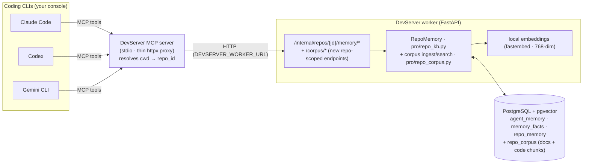

# Shared Repo Memory for Coding CLIs (Claude Code / Codex / Gemini) via MCP

> **Design note.** This is the architecture write-up for DevServer's shared-memory
> MCP server. The memory and corpus tools ship in DevServer Pro; the free edition
> includes the task-control tools only (see `apps/mcp-memory/README.md`). File paths
> under `pro/` and `routes/pro_internal.py` are not part of the free edition.

Let an interactive coding CLI **reuse the same per-repo Memory Knowledge Base**
DevServer builds — so when you work the same project from the Claude Code (or
Codex / Gemini) console, the model is grounded in the repo's saved facts,
decisions, prior attempts and digest. Goal: **fewer tokens** (pull only what's
needed) and **sharper, in-context decisions** (less hallucinating work that was
never asked for).

> **Decisions locked in (from the option round):**
> **MCP server**, backed by a **proxy to the running DevServer worker**,
> **auto-detecting the repo from the console's cwd**, with **read + write**
> access, and **provider-agnostic** (one server, configured into Claude Code,
> Codex, and Gemini CLI).

Companion to `docs/repo-memory-refactor-plan.md` and `docs/RLM.md`.

---

## 1. Why MCP (and not files / direct DB)

- **Pull-on-demand = token economy.** The model fetches the *specific* lane it
  needs (a fact, a past decision, whether an approach already failed) instead of
  a big static blob pushed into every prompt. This is the RLM pull pattern
  (`docs/RLM.md`) extended to the console.
- **One server, every vendor.** Claude Code, Codex, and Gemini CLI all speak
  **MCP**, so a single server serves all three — true provider-awareness with no
  per-vendor logic.
- **Single source of truth.** The MCP server is a thin proxy to the worker's
  existing `/internal` memory endpoints → reuses the live `RepoMemory`, hybrid
  recall, and local embeddings. No second copy of the KB, no DB creds or
  fastembed in the console.
- **Two corpora, not just task memory.** Beyond the task-derived lanes
  (experience / facts / decisions / transcripts), the same server can search a
  **repo corpus**: the repo's own **markdown docs** and **source code**, chunked
  and embedded once and queried semantically on demand ("how does auth flow
  work?", "where do we handle margin calls?"). This is the capability ported
  from FinCore's `knowledge_*` / `code_*` MCP tools — rebuilt on DevServer's
  existing per-repo, 768-dim, hybrid substrate (§3.4).

A generated context-file export (CLAUDE.md / AGENTS.md / GEMINI.md) is *not* the
primary mechanism here, but a one-line bootstrap hint is an optional add-on
(§6).

---

## 2. Architecture



The CLI launches the MCP server with **cwd = your project dir**; the server
resolves that path to a DevServer `repo_id` once, then every tool call is
scoped to that repo's memory.

---

## 3. What to build

### 3.1 Worker — repo-scoped memory endpoints (Pro · `routes/pro_internal.py`)

Today's lanes are **task-keyed** (`/tasks/{key}/memory/...`) — a console has no
DevServer task. Add **repo-scoped** mirrors (same `RepoMemory` calls, but resolve
`repo_id` directly and tag writes `source='console'`, `source_task_id=NULL`):

| Method | Path | Backed by |
|---|---|---|
| `GET` | `/internal/repos/resolve?path=<abs>` | match `repos` (local root / clone_url) → `{repo_id, name, provider}` |
| `GET` | `/internal/repos/{id}/wake-digest` | `RepoMemory.wake_up_digest()` — cheap grounding |
| `GET` | `/internal/repos/{id}/memory/recall?q=&topic=&limit=` | `recall` (hybrid) |
| `GET` | `/internal/repos/{id}/memory/transcripts?q=&limit=` | `recall_transcripts` |
| `GET` | `/internal/repos/{id}/memory/facts?q=&subject=&limit=` | `search_facts` / `query_facts` |
| `GET` | `/internal/repos/{id}/memory/decisions?q=&limit=` | `recall_decisions` |
| `GET` | `/internal/repos/{id}/repo-map?subdir=&max_chars=` | `repo_map.build_repo_map` (local repo root = your cwd) |
| `POST` | `/internal/repos/{id}/memory/remember` | `remember(kind='note', metadata.source='console')` |
| `POST` | `/internal/repos/{id}/facts` | `record_fact(source_task_id=None)` |
| `POST` | `/internal/repos/{id}/decisions` | `record_decision(...)` |
| `GET` | `/internal/repos/{id}/corpus/search?q=&kind=&language=&path_prefix=&limit=` | `RepoCorpus.search` (hybrid over docs+code) — §3.4 |
| `GET` | `/internal/repos/{id}/corpus/stats` | `RepoCorpus.stats()` — per-kind chunk/file counts (the `knowledge_list_projects` analog, now per-repo) |
| `POST` | `/internal/repos/{id}/corpus/ingest` | `RepoCorpus.ingest_docs / ingest_code` — manual reindex (auto on task success otherwise) |

Notes:
- Reuse the existing per-lane bodies — factor the shared logic out of the
  task-keyed handlers so the repo-keyed ones are ~5 lines each.
- `resolve`: for `provider='local'`, match when the requested path **equals or is
  under** `repos.gitea_url` (the local root); otherwise compare the git remote
  (the server can also accept a `?remote=` param). Return 404 when nothing
  matches so the MCP server can surface "this folder isn't a DevServer repo".
- Writes go through the existing secret-screen path and are tagged
  `metadata.source='console'` (+ optional `agent` = the CLI name) for a
  per-surface diary and easy filtering/rollback. Emits `memory_queried` (reads)
  and the existing `fact_recorded` / `decision_recorded` (writes).
- Gate console writes behind a setting `memory_allow_console_writes` (default
  **on**, since you chose read+write) so they can be disabled without unplugging
  the MCP server.

### 3.2 The MCP server (new · thin · provider-agnostic)

A small **stdio** MCP server that proxies the worker over HTTP. Only needs an
MCP SDK + `httpx` — no DB, no embeddings. Recommend **`fastmcp`** (terse) or the
official `mcp` SDK.

- **Pro-only.** The whole shared-memory surface is a Pro feature: the MCP
  server package lives at `apps/mcp-memory/` and is **deleted by
  `scripts/strip-pro.sh`** together with `services/pro/` and `pro_internal.py`.
  The free edition ships a trimmed build of the same package with only the
  task-control tools (`task_*`), which proxy the always-present
  `/internal/tasks/*` endpoints.
- **Location:** `apps/mcp-memory/` (own tiny `pyproject.toml`, entry point
  `devserver-mcp`) to keep MCP deps out of the worker runtime.
- **Repo resolution:** on first tool call, run `git rev-parse --show-toplevel`
  from cwd (fallback: cwd), call `GET /internal/repos/resolve?path=…`, cache the
  `repo_id`. A `DEVSERVER_REPO_ID` env var overrides (escape hatch).
- **Config:** `DEVSERVER_WORKER_URL` (default `http://localhost:8000`), optional
  `DEVSERVER_TOKEN` (see §7).
- **Tools exposed** (names are vendor-neutral; descriptions tell the model when
  to call them):

| Tool | Args | Use |
|---|---|---|
| `wake_digest` | – | **Call first.** Cheap repo digest: identity, stats, top facts, recent decisions. |
| `memory_recall` | `query, limit?, topic?` | Hybrid recall of prior experience/decisions. |
| `memory_facts` | `query?, subject?, limit?` | Established project facts (build/test cmds, where things live, invariants). |
| `memory_decisions` | `query, limit?` | Past design decisions + reasoning. |
| `memory_transcripts` | `query, limit?` | Search verbatim prior-attempt transcripts ("did we try this and fail?"). |
| `code_search` | `query, language?, path_prefix?, limit?` | **Semantic** search over the repo's indexed source — conceptual questions where you don't know the symbol name. (For exact names, Grep is faster + always current.) |
| `doc_search` | `query, limit?` | Semantic search over the repo's indexed **markdown docs** (the `knowledge_search` analog). |
| `corpus_stats` | – | What's indexed for this repo: doc/code chunk + file counts, last reindex. |
| `corpus_ingest` | `kind, full?` | Re-index docs or code now (normally auto on task success; manual escape hatch). |
| `repo_map` | `subdir?, max_chars?` | Deeper symbol map of a directory. |
| `memory_remember` | `content, topic?` | Write a durable note (`kind='note'`, `source='console'`). |
| `record_fact` | `subject, predicate, object, topic?` | Write/supersede a fact. |
| `record_decision` | `problem, choice, alternatives?, reasoning?, outcome?` | Write a causal decision. |

- **Graceful degradation:** if the worker is unreachable or Pro is stripped
  (endpoints 404), tools return a short "memory unavailable — is the DevServer
  worker running with Pro?" so the model proceeds without crashing.

### 3.3 Cross-provider wiring (same stdio command everywhere)

**Claude Code** — project `.mcp.json` (or `claude mcp add`):
```json
{
  "mcpServers": {
    "DevServer": {
      "command": "uv",
      "args": ["run", "devserver-mcp"],
      "env": { "DEVSERVER_WORKER_URL": "http://localhost:8000" }
    }
  }
}
```

**Codex** — `~/.codex/config.toml`:
```toml
[mcp_servers.DevServer]
command = "uv"
args = ["run", "devserver-mcp"]
env = { DEVSERVER_WORKER_URL = "http://localhost:8000" }
```

**Gemini CLI** — `.gemini/settings.json`:
```json
{ "mcpServers": { "DevServer": {
  "command": "uv", "args": ["run", "devserver-mcp"],
  "env": { "DEVSERVER_WORKER_URL": "http://localhost:8000" }
} } }
```

All three launch the **same** server with cwd = the project, so repo
auto-detection works identically.

---

### 3.4 Repo corpus — semantic search over source & docs (ported from FinCore, improved)

The task-derived lanes (§3.1) answer *"what did we learn / decide / try?"*. They
do **not** answer *"how does this subsystem work?"* over code the agent never
wrote, or *"what do the design docs say?"*. FinCore solved that with a separate
pgvector knowledge base and five MCP tools (`knowledge_search`,
`knowledge_ingest`, `knowledge_list_projects`, `code_search`, `code_ingest`).
We port the **capability**, but rebuild it on DevServer's existing per-repo,
768-dim, hybrid-recall substrate rather than copying FinCore's standalone design
verbatim — fixing five concrete weaknesses along the way.

#### What FinCore did, and what we change

| Aspect | FinCore (`fincorepy/app/knowledge/`) | DevServer port (improved) | Why |
|---|---|---|---|
| **Embedder** | `sentence-transformers/all-MiniLM-L6-v2`, **384-dim**, second model to install/cache | Reuse the existing **`services/embeddings.py` fastembed (768-dim, `BAAI/bge-base-en-v1.5`)** | One local model, no extra ~400 MB download, stays [[feedback_local_first]]; matches the `vector(768)` columns already in the DB |
| **Namespacing** | free-text `project` string (`"FinCore"`, `"FinCore-code"`) — typo-prone, manual | **`repo_id` FK** (auto-resolved from cwd by `/repos/resolve`) + a `kind` discriminator (`doc`/`code`) | No ambiguity, `ON DELETE CASCADE` with the repo, and it slots into the same scoping every other lane already uses |
| **Chunk metadata** | one `metadata` JSONB shared by **all chunks of a file** (a code hit's `line_start`/`symbol_name` was the *whole file's* list — ambiguous) | **per-chunk columns** (`language`, `symbol_kind`, `symbol_name`, `namespace`, `line_start`, `line_end`) | A search hit points at the *exact* symbol + line range |
| **Search** | **pure cosine** (`embedding <=> q`); a GIN FTS index existed but was **never queried** | **hybrid** via the existing `search_memory_hybrid` (RRF k=60 × recency) over an embedding lane + a `content_tsv` lexical lane, optional LLM rerank | Lexical catches exact identifiers vector misses; we already have the machinery |
| **Re-index** | `content_hash` computed but **always re-embedded**; manual `knowledge_ingest` per folder | **incremental skip** by `file_hash`/`content_hash`; **auto re-ingest on task success** driven by `preflight.files_changed` (the diff DevServer already computes) | Embedding is the only expensive step — skip unchanged files; the corpus stays fresh with zero operator action |
| **Storage** | separate `knowledge` schema in a shared DB, cross-project | one **`repo_corpus`** table in the main DB, repo-scoped, Pro | Hybrid recall, topic scoping, decay and the MCP read lanes all apply uniformly |

We **keep** FinCore's genuinely good ideas: the heading-aware markdown chunker,
the regex (Tree-sitter-free) per-symbol code chunker for C#/Python/TS-JS/MQL5
with preamble capture + window-split of oversized symbols, the folder
**allowlist + ignore-fragments/suffixes** for code (don't index `bin/`, `obj/`,
`node_modules/`, generated `*.Designer.cs`, …), and the "Grep for exact names,
`code_search` for concepts" division of labour.

#### Schema (`repo_corpus`, idempotent in `001_initial.sql` per DevServer convention)

```sql
CREATE TABLE IF NOT EXISTS repo_corpus (
    id           BIGSERIAL PRIMARY KEY,
    repo_id      INT  NOT NULL REFERENCES repos(id) ON DELETE CASCADE,
    kind         VARCHAR(8) NOT NULL,            -- 'doc' | 'code'
    source_path  TEXT NOT NULL,                  -- repo-relative
    chunk_index  INT  NOT NULL,
    heading      TEXT,                           -- md heading, or "python · function · foo"
    content      TEXT NOT NULL,
    content_hash TEXT NOT NULL,                  -- sha256(chunk)  → per-chunk skip
    file_hash    TEXT NOT NULL,                  -- sha256(file)   → skip unchanged files
    token_count  INT,
    -- per-chunk code metadata (NULL for docs) — promoted out of JSONB:
    language     TEXT,
    symbol_kind  TEXT,
    symbol_name  TEXT,
    namespace    TEXT,
    line_start   INT,
    line_end     INT,
    topic        TEXT,                            -- reuse agent_runner._derive_topic
    embedding    vector(768),                     -- DevServer fastembed dim
    content_tsv  tsvector GENERATED ALWAYS AS (to_tsvector('simple', content)) STORED,
    metadata     JSONB NOT NULL DEFAULT '{}'::jsonb,
    created_at   TIMESTAMPTZ NOT NULL DEFAULT now(),
    updated_at   TIMESTAMPTZ NOT NULL DEFAULT now(),
    UNIQUE (repo_id, source_path, chunk_index)
);
CREATE INDEX IF NOT EXISTS idx_repo_corpus_repo ON repo_corpus(repo_id, kind);
CREATE INDEX IF NOT EXISTS idx_repo_corpus_path ON repo_corpus(repo_id, source_path);
CREATE INDEX IF NOT EXISTS idx_repo_corpus_file ON repo_corpus(repo_id, source_path, file_hash);
CREATE INDEX IF NOT EXISTS idx_repo_corpus_tsv  ON repo_corpus USING GIN (content_tsv);
CREATE INDEX IF NOT EXISTS idx_repo_corpus_hnsw ON repo_corpus
    USING hnsw (embedding vector_cosine_ops) WITH (m = 16, ef_construction = 64);
```

(A dedicated table — not `memory_type='code_chunk'` rows in `agent_memory` —
because corpus chunks are large, verbatim, and *excluded from default agent
recall* exactly like transcripts; they carry distinct columns and a different
freshness lifecycle. They still share the embedder, the hybrid lane, and the
`RepoMemory` object.)

#### Service (`services/pro/repo_corpus.py`, Pro)

`RepoCorpus(session, repo_id)` — a sibling of `RepoMemory`, reached via
`ProHooks.repo_corpus()` (Free returns a no-op so the worker still runs):

- `ingest_docs(globs=('**/*.md',), since_files=None)` — port FinCore's
  `chunker.chunk_markdown`; per-file atomic replace.
- `ingest_code(allowlist=None, since_files=None)` — port `code_chunker.chunk_code`
  + the allowlist/ignore walk from `code_ingest.py`; reuse `repo_map`'s existing
  language set/symbol regexes where they overlap (don't duplicate). Default
  allowlist is repo-agnostic (`src/`, `apps/`, `lib/`, …) and overridable via
  `corpus_code_allowlist`.
- `search(query, kind=None, language=None, path_prefix=None, top_k=8)` — route
  through the existing hybrid `search_memory_hybrid` against `repo_corpus`;
  filters become `kind=`, `language=`, `source_path LIKE prefix%` predicates;
  optional `RepoMemory._llm_rerank`.
- `stats()` — `GROUP BY kind` → `{doc:{files,chunks}, code:{files,chunks,languages}, last_reindex}`.
- **Incremental:** before embedding a file, compare its `file_hash` to the
  stored one for `(repo_id, source_path)`; unchanged → skip. Files gone from
  disk → delete their rows (FinCore's `ingest_files` deletion semantics).

#### Auto-reindex (free, the headline UX win)

`agent_runner.run_task()` already rebuilds the repo map and archives transcripts
on success. Add one more best-effort call there: feed `preflight.files_changed`
to `RepoCorpus.ingest_*(since_files=…)` so **the corpus re-indexes only the files
this task touched, automatically**, holding the repo lock it already holds. No
git hook, no manual `code_ingest`. Console-only repos (worked purely from the
CLI, never via a DevServer task) get a manual `corpus_ingest` MCP tool + the
`POST …/corpus/ingest` endpoint as the escape hatch.

#### Settings (opt-in, default on)

`memory_corpus_code`, `memory_corpus_docs`, `corpus_auto_reindex_on_success`,
`corpus_max_file_bytes` (skip huge generated files), `corpus_code_allowlist`
(comma-separated globs; empty = the built-in default).

---

## 4. The token-economy usage pattern

Tell the model (via tool descriptions and/or the optional bootstrap hint in §6):

1. **`wake_digest` once** at the start of a session/task → ~300–500 token
   grounding (repo identity, current facts, recent decisions). This alone
   prevents most "implement something out of context" drift.
2. **Pull a lane only when needed** — about to retry an approach? `memory_transcripts`.
   Unsure how a subsystem works? `code_search` (concept) / `repo_map subdir=…`
   (symbols) / `memory_facts` (where things live). What do the docs say?
   `doc_search`. Why was X chosen? `memory_decisions`. (Exact symbol name in
   hand → built-in Grep, not `code_search`.)
3. **Write back** the durable things you discover (`record_fact` /
   `record_decision`) so the next session — DevServer *or* console — starts
   sharper. The KB compounds across both surfaces.

Net effect: the big context lives in Postgres, not in every prompt; the model
fetches a few hundred tokens on demand instead of you pasting files.

---

## 5. Provider-awareness

- **Reads/writes** are plain MCP tools → identical for Claude Code, Codex, and
  Gemini. No vendor branching in the server.
- Writes carry `metadata.agent` = the calling CLI (`claude` / `codex` /
  `gemini`, from an env the config sets) so the KB keeps a per-surface diary and
  you can see/trust where a memory came from.
- The worker's *own* multi-vendor support (DevServer tasks on Claude/Gemini/
  Codex/GLM) is unaffected — this is purely an additional read/write surface.

---

## 6. Optional add-on — session bootstrap hint

Not a separate mechanism, just a nudge so the model reliably grounds itself.
Add one line to each CLI's auto-context file:

- Claude Code → `CLAUDE.md`, Codex → `AGENTS.md`, Gemini → `GEMINI.md`:
  > "A `DevServer` MCP server is available. At the start of a task call
  > `wake_digest`, and before implementing in an unfamiliar area pull
  > `memory_facts` / `memory_transcripts`. Record durable facts/decisions you
  > learn."

A tiny `scripts/install-memory-hint.sh` can append this to whichever files
exist. (Cheap; skip if you prefer tool-descriptions only.)

---

## 7. Pro/Free · security · settings

- **Pro (server + endpoints + tools).** The repo-scoped endpoints live in
  `pro_internal.py` and the MCP server package lives at `apps/mcp-memory/` —
  **both** are removed by `scripts/strip-pro.sh`. The free edition ships only
  the task-control tools of the MCP server and none of the memory endpoints. (Within a Pro install, if the
  worker is down or a corpus isn't indexed yet, individual tools still degrade
  to a graceful "memory unavailable" string rather than crashing the CLI.)
- **Local-first / auth.** The worker's `/internal` API is meant for localhost.
  The MCP server runs on your machine and talks to `localhost:8000`, so no auth
  is needed for the common case. If the worker is remote, add a shared
  `DEVSERVER_TOKEN` (Bearer header checked by a small dependency on the
  repo-scoped routes) — document but default off.
- **New setting:** `memory_allow_console_writes` (default on). New env:
  `DEVSERVER_WORKER_URL`, optional `DEVSERVER_REPO_ID`, `DEVSERVER_TOKEN`.
- **Corpus is Pro too** (§3.4). `repo_corpus` ingest/search live in
  `pro/repo_corpus.py` + `pro_internal.py`; with Pro stripped, `RepoCorpus`
  is the no-op stub and `code_search` / `doc_search` degrade to "unavailable".
  Corpus settings (`memory_corpus_code`, `memory_corpus_docs`,
  `corpus_auto_reindex_on_success`, `corpus_max_file_bytes`,
  `corpus_code_allowlist`) all default to a sensible on/empty state.

---

## 8. Phasing (each shippable alone)

> **Status (implemented).** Phases 1 & 2 are built: the repo-scoped GET/POST
> lanes + `/repos/resolve` live in `routes/pro_internal.py`, and the MCP server
> package is at `apps/mcp-memory/` (`devserver-mcp`) with all read,
> write, and corpus tools wired and `cwd → repo_id` resolution. The corpus
> tools (`code_search` / `doc_search` / `corpus_stats` / `corpus_ingest`) are
> present and degrade gracefully until Phase 4 ships the `/corpus/*` worker
> endpoints. `scripts/strip-pro.sh` removes `apps/mcp-memory/`.

- **Phase 1 — read path.** Repo-scoped GET endpoints + `/repos/resolve`;
  MCP server with `wake_digest` + the read tools + cwd→repo_id resolution;
  the three config snippets. *Delivers the token-saving grounding immediately.*
  ✅ **done.**
- **Phase 2 — write path.** Repo-scoped POST endpoints (`remember` / `facts` /
  `decisions`) with `source='console'` tagging + `memory_allow_console_writes`;
  MCP write tools. *Closes the loop so the console enriches the shared KB.*
  ✅ **done.**
- **Phase 3 — polish.** Optional bootstrap-hint installer, `DEVSERVER_TOKEN`
  auth for remote workers, resolution caching + clear "not a DevServer repo"
  errors, and a `/settings` toggle for console writes.
- **Phase 4 — repo corpus (§3.4).** `repo_corpus` schema + `pro/repo_corpus.py`
  (ported markdown/code chunkers, hybrid search, incremental ingest); the
  `/corpus/search|stats|ingest` endpoints; `code_search` / `doc_search` /
  `corpus_stats` / `corpus_ingest` MCP tools; auto-reindex hook in
  `run_task()` on `preflight.files_changed`. *Delivers semantic code/doc Q&A on
  top of task memory — independently shippable after Phase 1's read path.*

---

## 9. Risks & mitigations

- **Worker must be running** (you chose worker-proxy). Mitigation: clear tool
  errors; document `uv run uvicorn src.main:app …`. (A future standalone
  RepoMemory-backed mode could remove this, but duplicates DB/embedding setup —
  out of scope.)
- **Repo ambiguity** (two repos under one path, or a non-registered folder).
  Mitigation: `resolve` returns the best/strict match or 404; `DEVSERVER_REPO_ID`
  override.
- **Write quality** (console noise polluting the shared KB). Mitigation:
  `source='console'` tag + secret-screen + the kill-switch setting; supersession
  already lets a better fact replace a worse one.
- **MCP maturity differences** across CLIs. Mitigation: stick to core MCP tool
  primitives (no resources/prompts) that all three support; keep tool schemas
  simple (strings + ints).
- **Corpus cost / staleness** (§3.4). A first full `ingest_code` over a large
  repo embeds thousands of chunks. Mitigation: incremental `file_hash` skip +
  the auto-reindex only touches `preflight.files_changed`, so steady-state cost
  is ~the files one task edited; the allowlist keeps generated/vendored code
  out; `corpus_max_file_bytes` caps runaway files. A stale corpus degrades
  gracefully (search still returns the last-indexed view) and `corpus_stats`
  surfaces the last reindex time.
- **Regex chunker imprecision** (inherited from FinCore). Mitigation: chunks
  err large with full context and carry `line_start`/`line_end`, so a slightly
  mis-bounded symbol still lands the agent in the right region; Grep/LSP remain
  the authority for exact boundaries. Tree-sitter is a later upgrade, not a
  blocker.

---

## 10. Testing

- Worker: `resolve` matches a local repo by path and 404s otherwise; each
  repo-scoped GET returns the same shape as its task-keyed sibling; POST writes
  land with `metadata.source='console'`; writes blocked when
  `memory_allow_console_writes=false`.
- MCP server: cwd→repo_id resolution (+ env override); each tool maps to the
  right endpoint; worker-down and Pro-absent both yield a graceful tool error;
  write tools tag the agent name.
- Manual: from the repo folder, `claude` (then `codex`, `gemini`) → call
  `wake_digest`, `memory_facts`, `record_fact` and confirm the row appears in
  Postgres / the DevServer dashboard.
- Corpus (§3.4): `ingest_code` on a small repo indexes the expected files and
  skips the ignore-list; re-running with no file changes embeds **zero** chunks
  (incremental `file_hash` skip); deleting a file then re-ingesting removes its
  rows; `code_search` returns hits whose `line_start`/`line_end` point at the
  right symbol; `language` / `path_prefix` filters narrow correctly; a task that
  edits one file triggers an auto-reindex of only that file via
  `preflight.files_changed`.

---

### References
- MCP — Claude Code: project `.mcp.json` / `claude mcp add`; Codex:
  `~/.codex/config.toml [mcp_servers.*]`; Gemini CLI: `.gemini/settings.json`
  `mcpServers`.
- DevServer internals: `routes/pro_internal.py` (existing task-keyed lanes),
  `services/pro/repo_kb.py` (`RepoMemory`), `services/repo_map.py`,
  `services/embeddings.py` (768-dim fastembed), `docs/RLM.md` (pull pattern),
  `docs/repo-memory-refactor-plan.md`.
- Ported corpus design (§3.4): FinCore `fincorepy/app/knowledge/` —
  `chunker.py` (markdown), `code_chunker.py` (regex per-symbol),
  `code_ingest.py` (allowlist walk), `store.py` (pgvector search/upsert),
  `mcp_server.py` (`knowledge_*` / `code_*` FastMCP tools); DDL in FinCore
  `BusinessLogic/Migrations/00000001_InitialMigration.cs` (`knowledge.chunks`).
